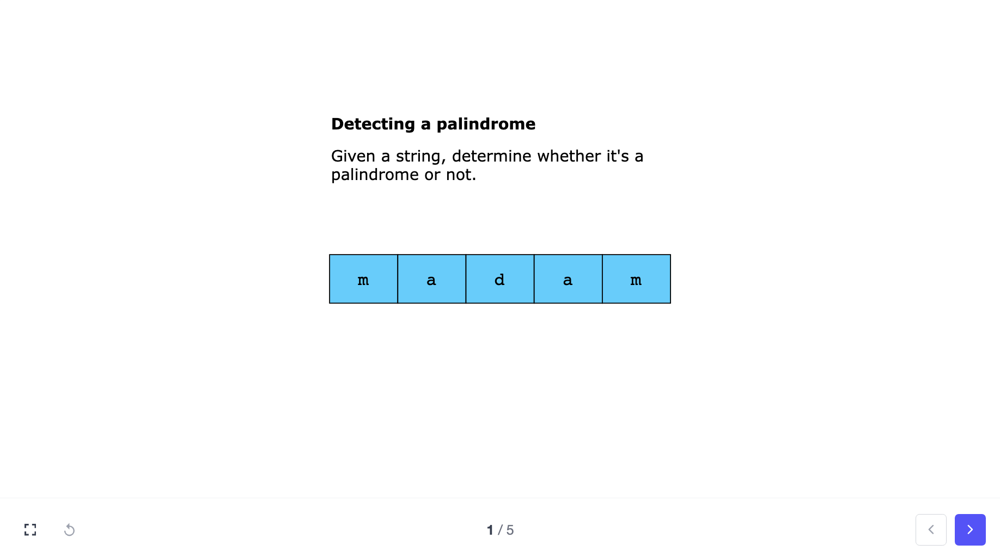
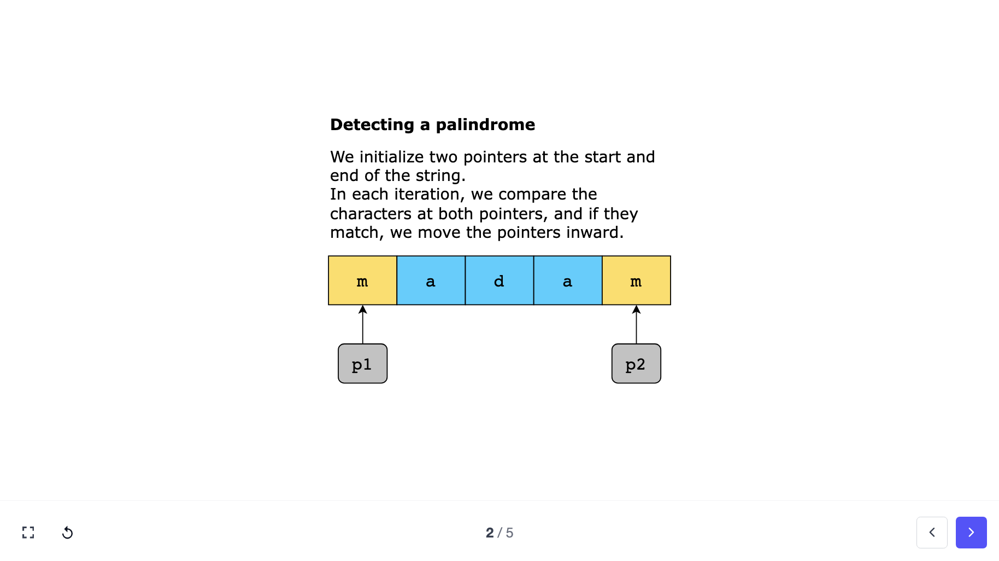
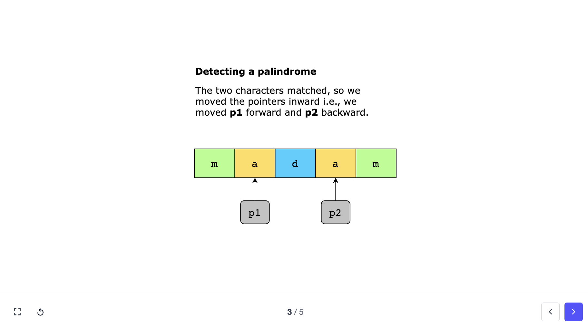
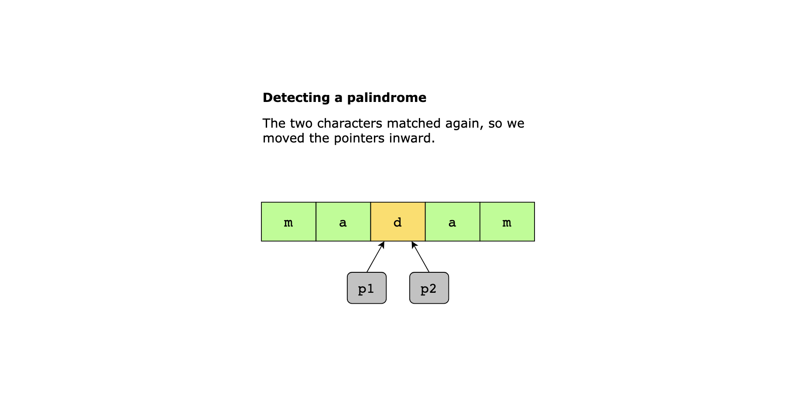
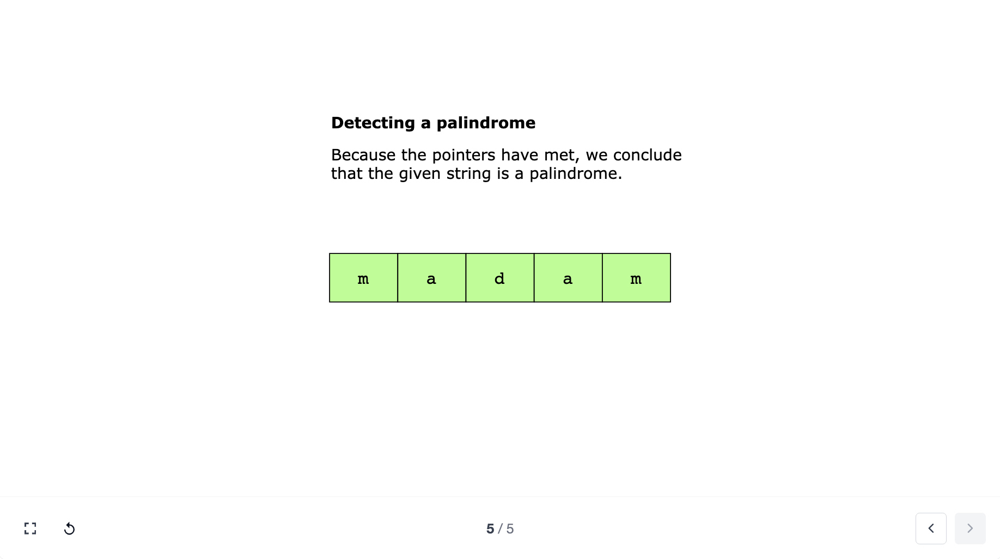

The two pointers pattern is a versatile technique used in problem-solving to efficiently traverse or manipulate sequential data structures, such as **arrays** or **linked lists**.

As the name suggests, it involves maintaining two pointers that traverse the data structure in a coordinated manner, typically starting from different positions or moving in opposite directions.

These pointers dynamically adjust based on specific conditions or criteria, allowing for the efficient exploration of the data and enabling solutions with optimal time and space complexity.

Whenever there’s a requirement to find two data elements in an array that satisfy a certain condition, the two pointers pattern should be the first strategy to come to mind.

The pointers can be used to iterate through the data structure in one or both directions, depending on the problem statement.

Eg:

1. 

2. 

3. 

4. 

5. 

The naive approach to solving this problem would be using nested loops, with a time complexity of O(n**2)

However, by using two pointers moving toward the middle from either end, we exploit the symmetry property of palindromic strings.

This allows us to compare the elements in a single loop, making the algorithm more efficient with a time complexity of O(n)

