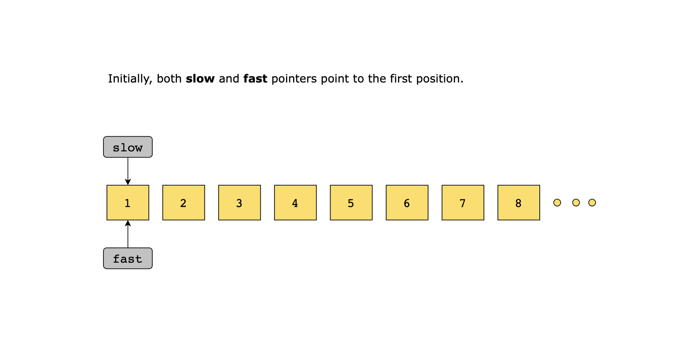
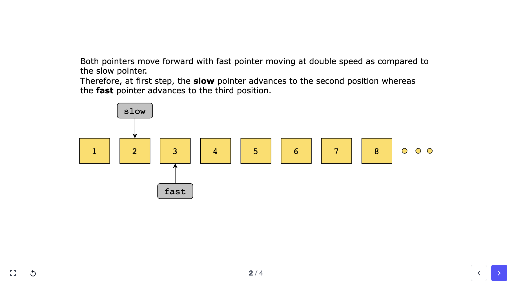
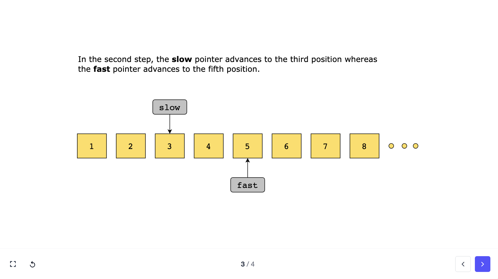
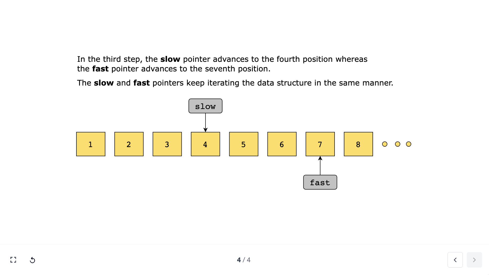

Similar to the two pointers pattern, the fast and slow pointers pattern uses two pointers to traverse an iterable data structure, but at different speeds, often to identify cycles or find a specific target.

- The speeds of the pointers can be adjusted according to the problem statement.
- The two pointers pattern focuses on comparing data values, whereas the fast and slow pointers method is typically used to analyze the structure or properties of the data.

- Due to the different speeds of the pointers, this pattern is also commonly known as the **Hare and Tortoise** algorithm.


```md
FUNCTION fastAndSlow(dataStructure):
  # initialize pointers (or indices)
  fastPointer = dataStructure.start   # or 0 if the data structure is an array
  slowPointer = dataStructure.start   # or 0 if the data structure is an array
  
  WHILE fastPointer != null AND fastPointer.next != null: 
    # For arrays: WHILE fastPointer < dataStructure.length AND (fastPointer + 1) < dataStructure.length:
    
    slowPointer = slowPointer.next            
    # For arrays: slowPointer = slowPointer + 1
    
    fastPointer = fastPointer.next.next       
    # For arrays: fastPointer = fastPointer + 2
    
    IF fastPointer != null AND someCondition(fastPointer, slowPointer):
      # For arrays: use someCondition(dataStructure[fastPointer], dataStructure[slowPointer]) if needed
      handleCondition(fastPointer, slowPointer)
      BREAK

  # process the result
  processResult(slowPointer)
  # For arrays: processResult(slowPointer) might process dataStructure[slowPointer]
```

Simple Demonstratioin










