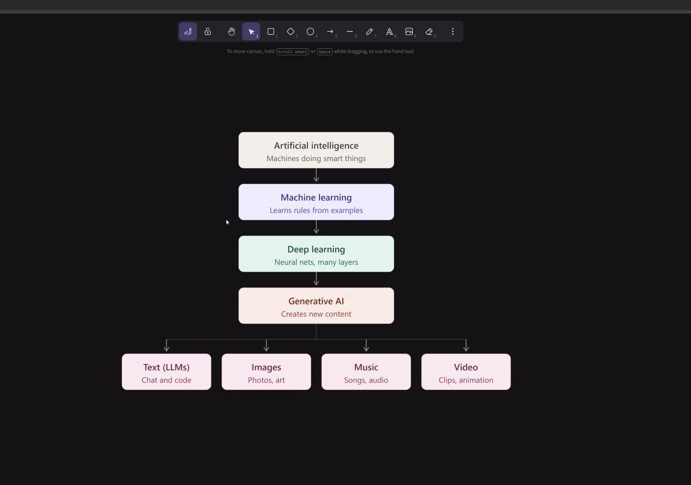
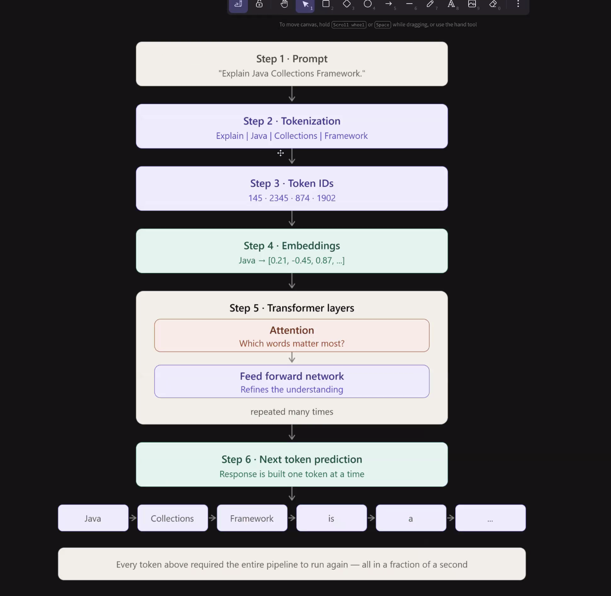

Transformer:

A transformer is a type of neural network architecture that has become the foundation of modern AI systems, especially for language models like ChatGPT. It was introduced in the 2017 paper "Attention Is All You Need."

```
Input Sentence
      │
      ▼
Word Embeddings
      │
      ▼
Positional Encoding
      │
      ▼
+------------------+
| Self-Attention   |
| Feed Forward     |
+------------------+
      │
   (Repeated many layers)
      │
      ▼
Output
```

How a transformer works
1. Input: Convert words into numbers (embeddings).
2. Positional Encoding: Add information about the order of words.
3. Self-Attention: Each word examines every other word to understand context.
4. Feed-Forward Network: The model further processes the information.
5. Repeat: These layers are stacked many times to build deeper understanding.
6. Output: Predict the next word, translate text, answer questions, summarize, or perform other tasks.

NLP:

NLP stands for Natural Language Processing.

It is a field of AI that helps computers understand, interpret, and generate human language.

For example, when you type:

“What is the weather today?”

NLP helps an AI understand:

“weather” → what information you're asking for
“today” → the time context
the whole sentence → your intent

```
Artificial Intelligence (AI)
│
└── Machine Learning (ML)
    │
    └── Deep Learning (DL)
        │
        ├── Transformers
        │     └── Used for NLP, vision, audio, etc.
        │
        └── Other neural networks
              ├── CNNs
              ├── RNNs
              └── etc.

NLP
└── A field/application of AI
    └── Can use Transformers, RNNs, etc.
```

Class:
Now a days
Ai is integrated
I want response based on my things (RAGs, Vectordb)

