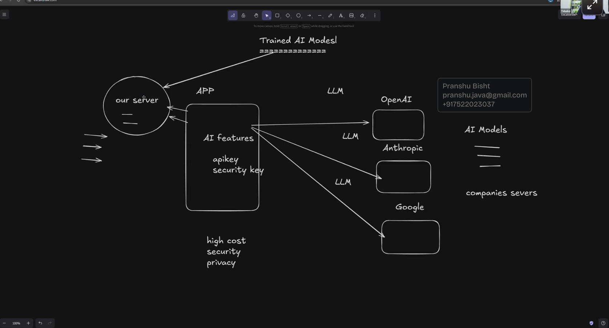

# CoverMake 

- LLM identify the image & creating image
- Hugging Face
- Open vs Closed Model
- Open Model/Weights --> Ollama --> Mistral
- Tool calling/Function calling


- Whenver we use LLM we share data to respective LLM providers other option might be downlaod a trained AI Models and run in own server.




- Everything which is freely available in the local system. It is not guarenteed It has liscence.

- Ollama -> Run open models (demostrate model in local)

- I was bit confused both name looks so similar

| **Feature**      | **Llama**                           | **Ollama**                                  |
| ---------------- | ----------------------------------- | ------------------------------------------- |
| **What it is**   | The actual AI **brain** (the model) | The **software engine** that runs the brain |
| **Creator**      | Meta (Facebook)                     | Independent developers (Jeffrey & Michael)  |
| **Name Meaning** | Large Language Model Meta AI        | A play on "Oh, Llama!"                      |


- AI engineer might work with open model as well as close model.
- 


Hugging Face is essentially a huge platform/community for AI models and datasets.


LangChain is a framework for building applications powered by large language models (LLMs) such as ChatGPT.
It provides tools to connect LLMs with prompts, documents, databases, APIs, memory, and other components.

## ChatPromptTemplate

ChatPromptTemplate is a structured template in LangChain designed for multi turn conversations and chat based workflows. It allows developers to define messages, roles and variables systematically for consistent LLM outputs.


| Class / method        | Purpose                                         |
| --------------------- | ----------------------------------------------- |
| `ChatPromptTemplate`  | Build prompts containing multiple chat messages |
| `PromptTemplate`      | Build a simple text prompt                      |
| `MessagesPlaceholder` | Insert a list of messages dynamically           |
| `.from_messages()`    | Create a chat prompt from message templates     |
| `.from_template()`    | Create a prompt from a template string          |
| `.invoke()`           | Supply variables to a prompt                    |
| `.format()`           | Format a prompt into a string                   |
| `.format_messages()`  | Format into chat messages                       |


 ## Runnable

In LangChain, a Runnable is a standard interface and fundamental building block representing a unit of work that takes an input, processes it, and returns an output

Core Standard MethodsEvery Runnable implements a consistent set of methods for execution:

- invoke: Processes a single input and returns a single output.

- batch: Processes a list of inputs efficiently, often in parallel.

- stream: Streams output data chunk-by-chunk for real-time responses.

- Async support: Every standard method comes with an asynchronous equivalent (ainvoke, abatch, astream)

## what can be runnable

Language Models (LLMs) and Chat ModelsPrompt TemplatesOutput ParsersRetrieversTools


## The | pipe operator

```
result = step1 | step2 | step3

input → step1 → step2 → step3 → output
```

### Chain:

> Do A, then use its result to do B, then use that result to do C.

### Pipe:

> Send the output of A into B, then B into C.

```
Input
  ↓
Function A
  ↓
Function B
  ↓
Function C
  ↓
Output
```


## How chain/pipe useful?

 In LangChain, a chain/pipe is useful because it lets you connect multiple AI-processing steps into a single workflow.

```py
from langchain_core.prompts import ChatPromptTemplate
from langchain_openai import ChatOpenAI
from langchain_core.output_parsers import StrOutputParser

prompt = ChatPromptTemplate.from_template(
    "Explain {topic} in simple terms."
)

llm = ChatOpenAI(model="gpt-4.1-mini")

chain = prompt | llm | StrOutputParser()
```


then


```py
result = chain.invoke({"topic": "Python decorators"})

print(result)
```

Conceptually, LangChain executes:

```
{"topic": "Python decorators"}
             ↓
          prompt
             ↓
     "Explain Python decorators
      in simple terms."
             ↓
            LLM
             ↓
      AIMessage(...)
             ↓
     StrOutputParser
             ↓
   "A decorator is ..."
```

- Without a chain, you'd have to manually manage each step:
```py
prompt_result = prompt.invoke({"topic": "Python decorators"})
llm_result = llm.invoke(prompt_result)
final_result = StrOutputParser().invoke(llm_result)
```


- With a pipe:
```
chain = prompt | llm | StrOutputParser()
```

> Take the output of this component and pass it as the input to the next component.


