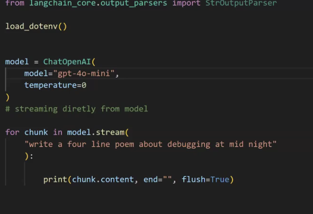

# Streaming in AI Engineering

**Streaming** means sending an AI model's response **piece by piece as it is generated**, instead of waiting for the complete response.

## Example

* ❌ **Non-streaming:** Wait → `Hello! How can I help you today?`
* ✅ **Streaming:** `Hello!` → `How` → `can` → `I` → `help` → `you`

## Why It Matters

* ⚡ Faster perceived response time
* 🖥️ Better real-time user experience
* 💬 Useful for chatbots and voice agents
* 🔄 Allows processing output as it arrives

## Typical Flow

```text
User → API → AI Model → Token Stream → UI
```

## Common Technologies

* **SSE (Server-Sent Events)**
* **WebSockets**
* **Streaming APIs**

## Streaming directly from the model



- Token affect will not be there

# Streaming Using a LangChain Chain

LangChain supports streaming so you don't have to wait for the complete LLM response.

## Basic Flow

```text
User
 ↓
Prompt
 ↓
LangChain Chain
 ↓
LLM
 ↓
Streamed Chunks
 ↓
Frontend
```

## Example

```python
from langchain_openai import ChatOpenAI
from langchain_core.prompts import ChatPromptTemplate

llm = ChatOpenAI(model="gpt-4o-mini")

prompt = ChatPromptTemplate.from_template(
    "Explain {topic} in simple terms."
)

chain = prompt | llm

for chunk in chain.stream({"topic": "RAG"}):
    print(chunk.content, end="", flush=True)
```

Instead of receiving:

```text
Explain RAG...
[wait]
RAG is a technique...
```

you receive chunks progressively:

```text
"RAG"
" is"
" a"
" technique"
" used"
" to"
...
```

## Important LangChain Streaming Methods

### `chain.stream()`

Streams the **final output** of the chain.

```python
for chunk in chain.stream(input):
    print(chunk)
```

Use this when you mainly want the generated answer.

### `chain.astream()`

Async version of `stream()`.

```python
async for chunk in chain.astream(input):
    print(chunk)
```

Useful with **FastAPI** and other async applications.

### `chain.stream_events()`

Provides **detailed events from the entire chain**, not just the final LLM output.

```python
async for event in chain.astream_events(input):
    print(event)
```

This can expose events such as:

```text
Chain started
 ↓
Retriever started
 ↓
Retriever finished
 ↓
LLM started
 ↓
LLM token/chunk
 ↓
LLM finished
 ↓
Chain finished
```

## `stream()` vs `astream_events()`

| Method             | What you get                   | Use case                            |
| ------------------ | ------------------------------ | ----------------------------------- |
| `stream()`         | Final output chunks            | Simple chatbot                      |
| `astream()`        | Async final output chunks      | Async backend                       |
| `astream_events()` | Detailed chain/LLM/tool events | Agents, RAG, debugging, advanced UI |

### In Short

**LangChain chain streaming =**

```text
chain.stream()
     ↓
LLM generates
     ↓
chunks arrive
     ↓
your backend forwards them
     ↓
user sees response in real time
```

For a **simple LLM chatbot**, start with `chain.stream()`.

For **RAG/agents where you want to see retriever, tool, and LLM activity**, use `astream_events()`.


