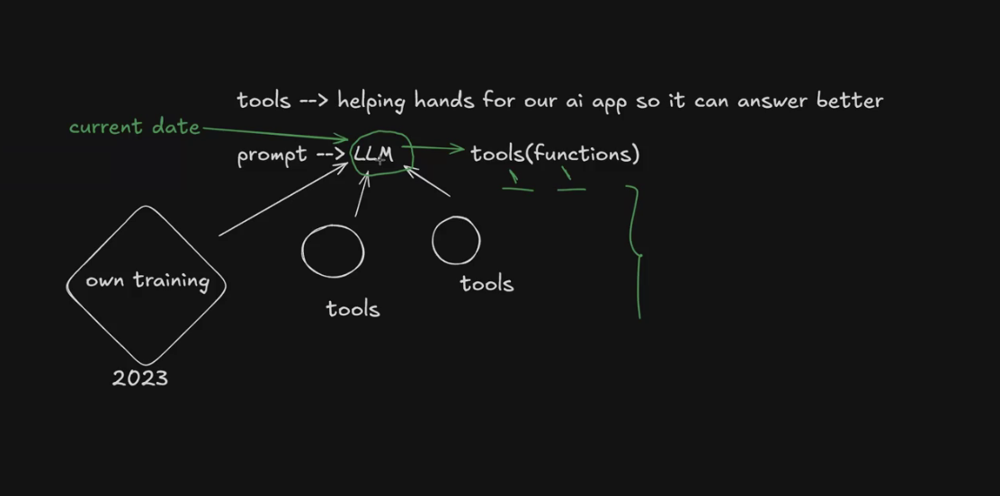
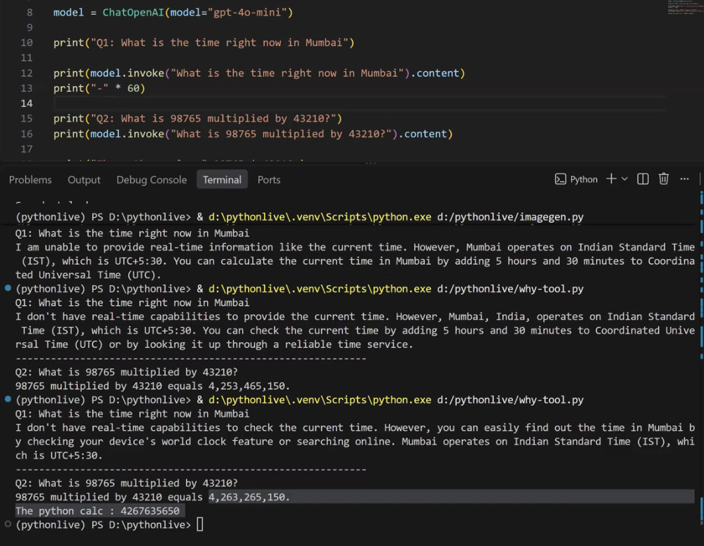

Tool is just a function
Langchain/Application will execute the tool

Create tool and make it availble to the LLM
LLM will request the python, Framework or langauge will execute the function based on system logic.



# Why tool is important



Here in this example AI answer is completely based on how its training & not on calulcation.

But if we provide a tool then definitely It can have calculation.

using @tool
LangChain tools are callable functions with well-defined inputs and outputs that let language models fetch real-time data, execute code, and interact with external systems

I can add multiple tools using model.bind_tools([
    convert_from_rupee,
    calculator,
    findWheater
])

### LLM needs three things to decide this tool should be use or not

1. Name of the tool
2. Description of the tool
3. Argumant

Note: LLM actully dont see the tool implementation.

```py
from langchain_core.tools import tool

@tool
def multiply(a: int, b: int):
    return a * b

multiply.invoke({"a": 2, "b": 4})   # → 8
```

- Without @tool, multiply(2, 4) directly calls the Python function. With @tool, multiply becomes a LangChain Tool, so we use multiply.invoke({"a": 2, "b": 4}) to execute it.
- multiply() calls a normal Python function, while multiply.invoke() executes a function that has been converted into a LangChain Tool using @tool.


# Pydantic

Its a library whenever we want a structured data we go with this.

Pydantic is a Python library for validating, parsing, and structuring data using type hints.

eg:
```py
from pydantic import BaseModel

class User(BaseModel):
    name: str
    age: int

user = User(name="Alice", age=25)

print(user.name)   # Alice
print(user.age)    # 25
```

## Why use Pydantic?

The main benefit is automatic validation. If invalid data is provided:

Pydantic raises a clear validation error because "hello" cannot be interpreted as an integer.

It can also convert compatible input when appropriate:

```py
user = User(name="Alice", age="25")

print(user.age)
# 25
```

Here, Pydantic can parse "25" into the integer 25.

## Where is it commonly used?

Pydantic is especially popular for:

- Validating API request/response data
- Reading configuration and environment variables
- Converting JSON/dictionaries into Python objects
- Defining structured data models
- Validating data in AI/LLM applications
 
For example, FastAPI uses Pydantic extensively to define and validate API data.

A useful mental model is:

> Python type hints describe what your data should look like → Pydantic checks that the actual data matches that description.


# Back to Tool Concept ()

`args_schema` in LangChain defines what inputs a tool accepts and the types/validation rules for those inputs.

```py
from pydantic import BaseModel, Field
from langchain_core.tools import StructuredTool

class CalculatorInput(BaseModel):
    a: int = Field(description="First number")
    b: int = Field(description="Second number")

def add(a: int, b: int):
    return a + b

calculator = StructuredTool.from_function(
    func=add,
    name="calculator",
    description="Add two numbers",
    args_schema=CalculatorInput
)
```

args_schema=CalculatorInput

means the tool expects:

```
{
  "a": 10,
  "b": 20
}
```


## Why is this useful?

The LLM needs to know what arguments it can provide.

```
Tool: calculator

Arguments:
  a → integer → first number
  b → integer → second number
```

The model can then generate a tool call such as:

```
{
  "a": 10,
  "b": 20
}
```

Pydantic validates those arguments before your function runs.

## Even simpler with @tool

For many tools, you don't need to explicitly create args_schema because LangChain can infer the schema from Python type hints:

```py
from langchain_core.tools import tool

@tool
def add(a: int, b: int) -> int:
    """Add two numbers."""
    return a + b
```

LangChain can infer:

```
a: int
b: int
```

> args_schema = the contract describing the inputs your tool accepts.


## this tool decorator

```py
@tool(
    "convert_from_rupees",
    args_schema=ConvertInput
)
def convert_from_rupees(amount: float, currency: str) -> str:
    """Convert an amount in Indian rupees into another currency."""
```

@tool(...) is a decorator that converts your Python function into a LangChain tool.

args_schema=ConvertInput

> Use the Pydantic model ConvertInput to define and validate the arguments this tool receives.


```
from pydantic import BaseModel, Field

class ConvertInput(BaseModel):
    amount: float = Field(description="Amount in Indian rupees")
    currency: str = Field(description="Currency to convert to")
```

```
                 ConvertInput
                      ↓
             ┌─────────────────┐
             │ amount: float   │
             │ currency: str   │
             └─────────────────┘
                      ↓
                  args_schema
                      ↓
              LangChain Tool
                      ↓
          convert_from_rupees()
```


