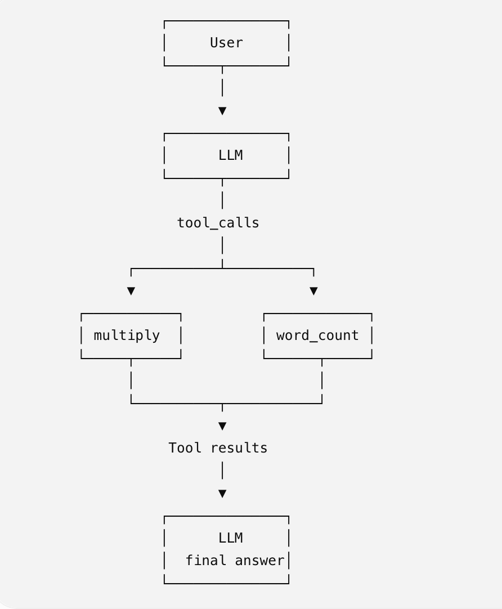
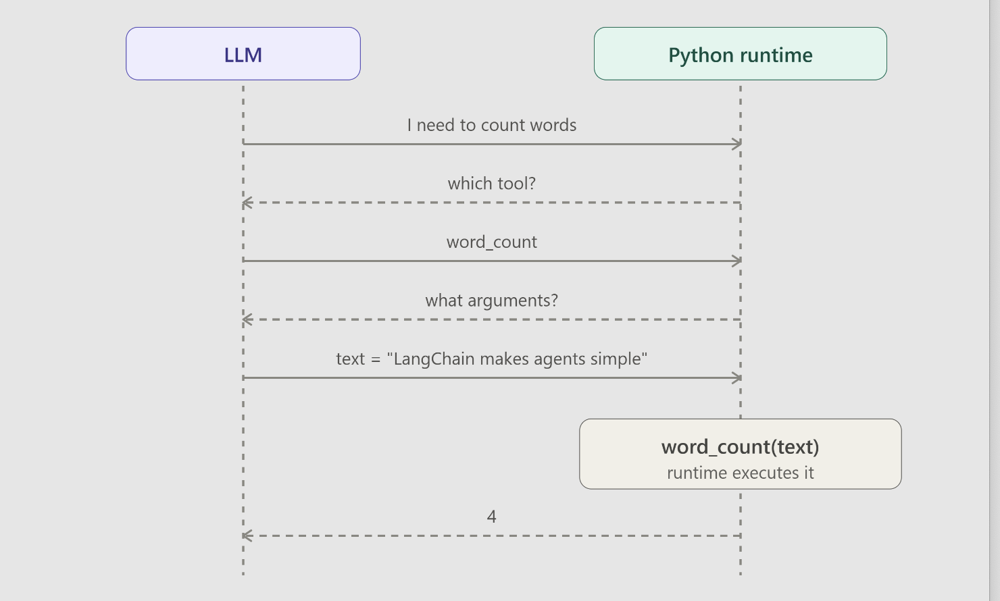

> User → LLM → Tool → Tool output → LLM → Final response

```
# main.py

from langchain_openai import ChatOpenAI
from langchain_core.tools import tool
from langchain_core.messages import HumanMessage, ToolMessage


# ============================================================
# 1. Define your tools
# ============================================================

@tool
def multiply(a: int, b: int) -> int:
    """Multiply two numbers."""
    result = a * b

    print(f"\n🔧 TOOL: multiply")
    print(f"   Input: a={a}, b={b}")
    print(f"   Output: {result}")

    return result


@tool
def word_count(text: str) -> int:
    """Count the number of words in a text."""
    result = len(text.split())

    print(f"\n🔧 TOOL: word_count")
    print(f"   Input: {text}")
    print(f"   Output: {result}")

    return result


# ============================================================
# 2. Put all tools in a list
# ============================================================

tools = [multiply, word_count]

# Give the tools to the model
llm = ChatOpenAI(
    model="gpt-4o-mini",
    temperature=0
)

llm_with_tools = llm.bind_tools(tools)


# ============================================================
# 3. Ask the model something
# ============================================================

user_input = """
Multiply 12 and 8.

Also count the words in this sentence:
"LangChain makes it easier to build AI applications."
"""

messages = [
    HumanMessage(content=user_input)
]


# ============================================================
# 4. First LLM call
# ============================================================

print("\n==============================")
print("1. CALLING LLM")
print("==============================")

response = llm_with_tools.invoke(messages)

print("\n🤖 LLM RESPONSE:")
print(response)


# ============================================================
# 5. Check whether the LLM wants to call tools
# ============================================================

if response.tool_calls:

    print("\n==============================")
    print("2. LLM REQUESTED TOOLS")
    print("==============================")

    # Add the LLM response to the conversation
    messages.append(response)

    # Create a dictionary so we can find tools by name
    tools_by_name = {
        tool.name: tool
        for tool in tools
    }


    # ========================================================
    # 6. Execute each requested tool
    # ========================================================

    for tool_call in response.tool_calls:

        tool_name = tool_call["name"]
        tool_args = tool_call["args"]
        tool_call_id = tool_call["id"]

        print(f"\n➡️ Calling: {tool_name}")
        print(f"➡️ Arguments: {tool_args}")

        # Find the actual Python function
        selected_tool = tools_by_name[tool_name]

        # Execute it
        tool_result = selected_tool.invoke(tool_args)

        # Add the result back into the conversation
        messages.append(
            ToolMessage(
                content=str(tool_result),
                tool_call_id=tool_call_id
            )
        )


    # ========================================================
    # 7. Call the LLM AGAIN
    # ========================================================

    print("\n==============================")
    print("3. CALLING LLM AGAIN")
    print("==============================")

    final_response = llm_with_tools.invoke(messages)


    # ========================================================
    # 8. Print final answer
    # ========================================================

    print("\n==============================")
    print("4. FINAL RESPONSE")
    print("==============================")

    print(final_response.content)

else:
    # No tool was needed
    print("\n==============================")
    print("FINAL RESPONSE")
    print("==============================")

    print(response.content)
```

What is happening?

Suppose the user asks:
Multiply 12 and 8 and count the words in this sentence.
The first LLM call doesn't necessarily calculate anything itself. Instead, it can return something conceptually like:

```
I need to call two tools.

multiply(a=12, b=8)

word_count(text="LangChain makes it easier to build AI applications.")
```

Python code sees:

```
response.tool_calls
```

for example

```
🔧 TOOL: multiply
   Input: a=12, b=8
   Output: 96

🔧 TOOL: word_count
   Input: LangChain makes it easier to build AI applications.
   Output: 8
```

Then you put those results back into the conversation:

```
messages.append(
    ToolMessage(
        content=str(tool_result),
        tool_call_id=tool_call_id
    )
)
```

## The key concept to remember

```
                  ┌──────────────┐
                  │     User     │
                  └──────┬───────┘
                         │
                         ▼
                  ┌──────────────┐
                  │      LLM     │
                  └──────┬───────┘
                         │
                    tool_calls
                         │
              ┌──────────┴──────────┐
              ▼                     ▼
        ┌───────────┐         ┌────────────┐
        │ multiply  │         │ word_count │
        └─────┬─────┘         └──────┬─────┘
              │                      │
              └──────────┬───────────┘
                         ▼
                   Tool results
                         │
                         ▼
                  ┌──────────────┐
                  │      LLM     │
                  │  final answer│
                  └──────────────┘
```





The most important distinction is:

```
response = llm_with_tools.invoke(messages)
```

gives you the LLM's tool request. then

```
tool_result = selected_tool.invoke(tool_args)
```
gives you the actual tool output. Then

```
final_response = llm_with_tools.invoke(messages)
```

gives you the final natural-language response.

# LangChain Agent Tool Calling Loop

## 1. Basic Agent Flow

The agent follows this pattern:

``` text
User
  ↓
LLM
  ↓
Does the LLM want to call a tool?
  ├── YES → Execute tool(s)
  │           ↓
  │        Tool result
  │           ↓
  │          LLM
  │           ↓
  │        Check again
  │
  └── NO → EXIT → Final response
```

The important idea is:

> The LLM decides which tool to use, the Python runtime executes the
> tool, and the tool result is sent back to the LLM.

------------------------------------------------------------------------

## 2. Example: `word_count`

Suppose the user asks:

``` text
Count the words in:
"LangChain makes agents simple"
```

The LLM decides that it needs the `word_count` tool.

Conceptually:

``` text
LLM
 ↓
"I need to count words"
 ↓
Which tool?
 ↓
word_count
 ↓
What arguments?
 ↓
text = "LangChain makes agents simple"
 ↓
Python runtime executes word_count(text)
 ↓
4
 ↓
LLM
```

The Python runtime actually executes:

``` python
word_count("LangChain makes agents simple")
```

and gets:

``` text
4
```

The result `4` is then returned to the LLM.

------------------------------------------------------------------------

## 3. The `for` Loop --- Multiple Tool Calls

A single LLM response can contain multiple tool calls.

For example:

``` python
response.tool_calls = [
    {
        "name": "multiply",
        "args": {"a": 10, "b": 5}
    },
    {
        "name": "word_count",
        "args": {
            "text": "LangChain makes agents simple"
        }
    }
]
```

So we use:

``` python
for tool_call in response.tool_calls:
    ...
```

This means:

> Execute every tool requested by the current LLM response.

The execution becomes:

``` text
multiply(10, 5)
      ↓
     50

word_count("LangChain makes agents simple")
      ↓
      4
```

### Why not just use `[0]`?

This:

``` python
tool_call = response.tool_calls[0]
```

only handles the first tool call.

The `for` loop handles all of them.

------------------------------------------------------------------------

## 4. The `while` Loop --- Overall Agent Loop

The `while` loop handles repeated rounds between the LLM and tools:

``` python
while True:
    response = llm_with_tools.invoke(messages)

    if not response.tool_calls:
        break

    for tool_call in response.tool_calls:
        ...
```

It allows the agent to do:

``` text
LLM
 ↓
Tool
 ↓
LLM
 ↓
Tool
 ↓
LLM
 ↓
EXIT
```

The agent continues until the LLM no longer requests a tool.

------------------------------------------------------------------------

## 5. The Exit Branch

This is the exit condition:

``` python
if not response.tool_calls:
    break
```

It means:

> If the LLM did not request any tools, stop the agent loop.

For example:

``` python
response.tool_calls == []
```

Then:

``` text
No tool needed
     ↓
Final LLM response
     ↓
EXIT
```

------------------------------------------------------------------------

## 6. `while` vs `for`

These two loops have different jobs.

### `while`

``` python
while True:
```

Controls the **overall agent loop**.

``` text
LLM → Tools → LLM → Tools → LLM → EXIT
```

### `for`

``` python
for tool_call in response.tool_calls:
```

Controls the **tools requested in one LLM response**.

``` text
One LLM response
       ↓
 ┌─────┼─────┐
 ↓     ↓     ↓
Tool1 Tool2 Tool3
```

### Easy way to remember

> **`while` = keep the agent going**

> **`for` = execute every tool requested by the current LLM response**

------------------------------------------------------------------------

## 7. Core Agent Pattern

The whole concept can be reduced to:

``` python
while True:

    # Ask the LLM what to do
    response = llm_with_tools.invoke(messages)

    # EXIT branch
    if not response.tool_calls:
        break

    # TOOL branch
    for tool_call in response.tool_calls:

        # Find and execute the requested tool
        result = execute_tool(tool_call)

        # Send the result back to the LLM
        messages.append(
            ToolMessage(
                content=str(result),
                tool_call_id=tool_call["id"]
            )
        )
```

The flow is:

``` text
              ┌─────────────┐
              │     LLM     │
              └──────┬──────┘
                     ↓
             tool_calls?
                /       \
              YES        NO
               ↓          ↓
        Execute tools    EXIT
               ↓          ↓
          Tool result   Final response
               ↓
              LLM
               │
               └──────────────→ check again
```

**Key takeaway:** The `for` loop handles multiple tools within one LLM
response, while the `while` loop keeps the entire agent running until
there are no more tool calls.


Code Example: https://github.com/telusko-aliens/agentic-ai-engineering-with-python/tree/main/Tool%20Calling%20(Part-2)%20-%2005-09-2026/pythonlive


