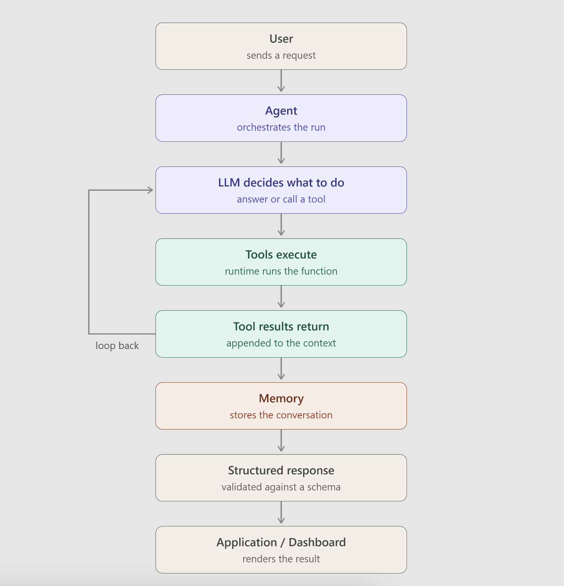

# LangChain Multi-Tool Agents — Learning Notes

## Overview

These notes build up in three stages:

1. **Multi-tool agent** — the LLM picks from several tools (`create_agent()` basics)
2. **Streaming an agent** — watching the tool-calling loop happen step-by-step
3. **Agent with memory** — giving the agent a persistent conversation state via `thread_id`

Pattern for each example below: **full code first, then a section-by-section explanation.**

---

## 1. Multi-Tool Agent — Online Store Example

### 1.1 Full Code

```python
import sys

from dotenv import load_dotenv
from langchain.agents import create_agent
from langchain_core.tools import tool


load_dotenv()
sys.stdout.reconfigure(encoding="utf-8")


# our data --> imagine its our order data base
ORDERS = {
    "ORD-1001": {
        "item": "Wireless mouse",
        "status": "shipped",
        "amount": 1499
    },

    "ORD-1002": {
        "item": "Mechanical keyboard",
        "status": "packed",
        "amount": 4999
    },
}
# imagine we have warehouse stock
STOCK = {
    "wireless mouse": 12,
    "mechanical keyboard": 0,
    "usb hub": 34
}

# our tool of this app

# =========================================================
# TOOL 1
# =========================================================

@tool
def order_status(order_id: str) -> str:
    """
    Get the status and amount of an order using its id,
    for example ORD-1001.
    """

    order = ORDERS.get(order_id.upper())

    if order is None:
        return f"No order found with id {order_id}."

    return (
        f"{order['item']}, "
        f"status {order['status']}, "
        f"amount {order['amount']} rupees"
    )


# =========================================================
# TOOL 2
# =========================================================

@tool
def check_stock(item: str) -> str:
    """
    Check how many units of an item are left in the warehouse.
    """

    count = STOCK.get(item.lower())

    if count is None:
        return f"{item} is not in the catalogue."

    return f"{count} units of {item} in stock"


# =========================================================
# TOOL 3
# =========================================================

@tool
def apply_discount(amount: float, percent: float) -> float:
    """
    Apply a discount percentage to an amount
    and return the new amount.
    """

    return round(
        amount - (amount * percent / 100),
        2
    )


# =========================================================
# TOOL 4
# =========================================================

@tool
def delivery_days(pin_code: str) -> str:
    """
    Estimate delivery time for an Indian pin code.
    """

    metro = {
        "400001",
        "110001",
        "560001"
    }

    return "2 days" if pin_code in metro else "5 days"

agent = create_agent(
   model="openai:gpt-4o-mini",
   tools=[
        order_status,
        check_stock,
        apply_discount,
        delivery_days
   ],
   system_prompt=(
        "You are a support assistant for an online store. "
        "Use the tools for anything about orders, stock, "
        "pricing or delivery"
        "Never guess a number, look it up."
   ),

)

# Helper function
def ask(question):

    # Print the user's question.
    print("Q:", question)
    result = agent.invoke({
        "messages": [
            {
                "role": "user",
                "content": question
            }
        ]
    })
    print(
        "A:",
        result["messages"][-1].content
    )

    print("-" * 60)

ask("What is the status of order ORD-1001")
ask("Do you have a mechanical keyboard in stock")
ask("when the mechanical keyboard will be available again ?")
ask(
    "For order ORD-1002, what would the price be "
    "after a 10 percent discount?"
)
```

### 1.2 What's going on

**The application "databases".** `ORDERS` and `STOCK` are plain Python dicts standing in for a real database.

```text
Order Database                    Warehouse Database
     │                                   │
     ├── ORD-1001 → Wireless mouse       ├── wireless mouse: 12
     │              → shipped → ₹1499    ├── mechanical keyboard: 0
     └── ORD-1002 → Mechanical keyboard  └── usb hub: 34
                    → packed → ₹4999
```

**The four tools.**

| Tool | Purpose | Example call → result |
|---|---|---|
| `order_status` | Look up an order by ID | `order_status("ORD-1001")` → `"Wireless mouse, status shipped, amount 1499 rupees"` |
| `check_stock` | Check units left in warehouse | `check_stock("mechanical keyboard")` → `"0 units of mechanical keyboard in stock"` |
| `apply_discount` | Compute price after a % discount | `apply_discount(4999, 10)` → `4499.1` |
| `delivery_days` | Estimate delivery time by PIN code | `delivery_days("400001")` → `"2 days"` |

Each is a normal Python function decorated with `@tool`. The decorator exposes it to the LLM as something it's *allowed to call* — the LLM never runs the function itself, it only requests the call; LangChain executes it.

**Creating the agent.**

```python
agent = create_agent(
    model="openai:gpt-4o-mini",
    tools=[order_status, check_stock, apply_discount, delivery_days],
    system_prompt="...",
)
```

This tells LangChain: *here's a model, here are its tools, here's how it should behave.* The LLM decides **which** tool(s) a question needs — you don't route manually.

**`create_agent()` manages the tool-calling loop.** Without it, you'd hand-write:

```python
while True:
    response = model.invoke(messages)
    if not response.tool_calls:
        break
    for call in response.tool_calls:
        ...
```

`create_agent()` hides this loop:

```text
                 LLM
                  │
                  ▼
           Tool requested?
             /         \
           YES          NO
            │            │
            ▼            ▼
       Execute tool     EXIT
            │
            ▼
       Tool result
            │
            ▼
           LLM
            │
            └──────────→ check again
```

**Walking through each `ask()` call:**

1. **`"What is the status of order ORD-1001"`** → LLM picks `order_status` → returns the order details → LLM phrases the final answer.

2. **`"Do you have a mechanical keyboard in stock"`** → LLM picks `check_stock` → returns `"0 units..."` → LLM answers. Note: the LLM chose the right tool purely from the tool's docstring/description, no manual routing.

3. **`"when the mechanical keyboard will be available again ?"`** → There is **no restock-date data or tool**. Key principle:
   > An agent cannot magically produce information that isn't available in its data or tools. It also won't guess, because the system prompt says *"Never guess a number, look it up."*

4. **`"...what would the price be after a 10 percent discount?"`** → Needs **two tools chained**: first `order_status("ORD-1002")` → `₹4999`, then `apply_discount(4999, 10)` → `₹4499.10`. This shows the agent using the **output of one tool as input to another**:

```text
LLM → order_status(ORD-1002) → ₹4999 → LLM → apply_discount(4999, 10) → ₹4499.10 → LLM → Final Answer
```

**The `ask()` helper.** Just avoids repeating `agent.invoke(...)` boilerplate for every question.

**`result["messages"]`.** The agent returns the full conversation:

```text
HumanMessage   → the question
AIMessage      → tool call request
ToolMessage    → tool result
AIMessage      → final answer
```

`result["messages"][-1].content` grabs that last, final answer.

**Manual loop vs `create_agent()`:** writing the loop yourself is good for *understanding* internals; `create_agent()` is what you use to actually *build* something.

**`while` vs `for` (if you ever write the manual loop):**

- `while True:` → controls the **overall agent loop** (keep going until no more tool calls)
- `for call in response.tool_calls:` → handles **multiple tools requested in one single LLM response**

> **`while` = keep the agent going. `for` = execute every tool requested in the current response.**

### 1.3 Mental model for this example

```text
                         USER
                           │
                           ▼
                          LLM
                           │
                    Which tool?
                           │
          ┌────────────────┼────────────────┐
          ▼                ▼                ▼
    order_status      check_stock      apply_discount
          │                │                │
          └────────────────┼────────────────┘
                           │
                           ▼
                      Tool result
                           │
                           ▼
                          LLM
                           │
                    Need another tool?
                     /             \
                   YES              NO
                    │                │
                    ▼                ▼
              Execute tool        FINAL ANSWER
                    │
                    └──────→ LLM
```

**Takeaway:** tools = the agent's capabilities, LLM = the decision-maker, `create_agent()` = the loop manager.

---

## 2. Streaming an Agent — Trip Planner Example

Same idea as above (multiple tools, LLM decides), but here we watch the loop happen **step by step** using `.stream()` instead of `.invoke()`.

### 2.1 Full Code

```python
import sys

from dotenv import load_dotenv
from langchain.agents import create_agent
from langchain_core.tools import tool


load_dotenv()

sys.stdout.reconfigure(encoding="utf-8")

# =========================================================
# TOOL 1
# =========================================================

@tool
def ticket_price(city: str) -> int:
    """
    Get the flight ticket price in rupees
    from Mumbai to a city.
    """

    prices = {
        "delhi": 4500,
        "bengaluru": 3900,
        "kolkata": 5200
    }

    return prices.get(city.lower(), 6000)


# =========================================================
# TOOL 2
# =========================================================

@tool
def hotel_price(city: str, nights: int) -> int:
    """
    Get the total hotel cost in rupees
    for a number of nights in a city.
    """

    per_night = {
        "delhi": 3000,
        "bengaluru": 3500,
        "kolkata": 2800
    }

    return per_night.get(city.lower(), 3200) * nights

agent = create_agent(
   model="openai:gpt-4o-mini",
   tools=[
        ticket_price,
        hotel_price
   ],
   system_prompt=(
        "You plan small trips and always look up "
        "real numbers with the tools."
   ),

)
question = (
    "I want to go to Bengaluru for 3 nights "
    "from Mumbai. What is my total cost?"
)
for chunk in agent.stream(
    {
        "messages": [
            {
                "role": "user",
                "content": question
            }
        ]
    },
    stream_mode="updates"   # this is to tell our agent give me update as each step happens
):
    for node, update in chunk.items():
        for message in update["messages"]:

            # the llm  requested the tool

            if getattr(message, "tool_calls", None):

                print(
                    f"[{node}] wants: "
                    f"{[c['name'] for c in message.tool_calls]}"
                )

                # a tool has done executing
            elif type(message).__name__ == "ToolMessage":

                print(
                    f"[{node}] "
                    f"{message.name} returned: "
                    f"{message.content}"
                )
                # this could be the final answer
            elif message.content:

                print(
                    f"[{node}] says: "
                    f"{message.content}"
                )
```

### 2.2 What's going on

**Two new tools**, same `@tool` pattern as before: `ticket_price(city)` and `hotel_price(city, nights)`. The question needs *both* — a two-tool chain, just like the discount example above.

**The key difference from Example 1 is `.stream()` instead of `.invoke()`.**

- `agent.invoke(...)` → waits for everything, then gives you the final `result` in one go.
- `agent.stream(..., stream_mode="updates")` → yields a `chunk` after **every step** of the loop (every LLM turn, every tool execution), so you can watch the agent think in real time.

**Reading the loop:**

```python
for chunk in agent.stream(...):
    for node, update in chunk.items():
        for message in update["messages"]:
```

- Outer loop: one `chunk` per step of the agent loop.
- `node` is which part of the graph produced this update (e.g. the model node or a tool node).
- Inner loop: the message(s) inside that update.

**Classifying each message:**

| Check | Meaning |
|---|---|
| `message.tool_calls` is truthy | The LLM just **requested** a tool call — print which tool(s) it wants |
| `type(message).__name__ == "ToolMessage"` | A tool **finished executing** — print what it returned |
| `message.content` is truthy (and neither of the above) | This is LLM **text** — could be the final answer |

**What you'd actually see printed**, conceptually:

```text
[...] wants: ['ticket_price']
[...] ticket_price returned: 3900
[...] wants: ['hotel_price']
[...] hotel_price returned: 10500
[...] says: <final combined cost, phrased by the LLM>
```

**Why this matters:** `.invoke()` hides the loop; `.stream()` exposes it. Useful for debugging *which* tool the agent chose and *why* an answer took multiple steps.

---

## 3. Agent with Memory — Seat Booking Example

### 3.1 Full Code

```python
import sys
from dotenv import load_dotenv
from langchain.agents import create_agent
from langchain_core.tools import tool
from langgraph.checkpoint.memory import InMemorySaver

load_dotenv()

sys.stdout.reconfigure(encoding="utf-8")

@tool
def book_seat(name: str, seat: str) -> str:
    """Book a seat in the class for a person."""
    return f"Seat {seat} booked for {name}."

agent = create_agent(
    model="openai:gpt-4o-mini",
    tools=[book_seat],
    system_prompt="You help learners book a seat in the LangChain class.",
    checkpointer=InMemorySaver(),  # this tell agent to store conversation after each step
)

def ask(question, thread_id):
    result = agent.invoke(
        {
            "messages": [
                {
                    "role": "user",
                    "content": question
                }
            ]
        },
        config={"configurable": {"thread_id": thread_id}},
    )
    print(f"[{thread_id}] Q: {question}")
    print(f"[{thread_id}] A: {result['messages'][-1].content}")
    print()

ask("My name is vinay kumar gurram", thread_id="vinay")

ask("Book me a seat A12.", thread_id="vinay")

ask("What is my name and what seat did i book", thread_id="vinay")

ask("What is my name and what seat did i book", thread_id="nimish")
```

### 3.2 What's going on

**New imports:**

- `InMemorySaver` — stores conversation state in memory (RAM, not disk) so the agent can recall earlier turns.

**One tool this time:**

```python
@tool
def book_seat(name: str, seat: str) -> str:
    """Book a seat in the class for a person."""
    return f"Seat {seat} booked for {name}."
```

Same `@tool` pattern — the LLM requests it, LangChain executes the actual Python.

**Creating the agent with a checkpointer:**

```python
agent = create_agent(
    model="openai:gpt-4o-mini",
    tools=[book_seat],
    system_prompt="...",
    checkpointer=InMemorySaver(),
)
```

Mental model:

```text
Agent
 ├── LLM
 ├── Tools
 │    └── book_seat()
 └── Memory
      └── InMemorySaver
```

**Calling with a `thread_id`:**

```python
agent.invoke(
    {"messages": [...]},
    config={"configurable": {"thread_id": thread_id}},
)
```

`thread_id` identifies **which conversation** this call belongs to — like a session/chat ID. `thread_id="vinay"` means *use Vinay's conversation history*.

**Walking through the calls:**

1. `ask("My name is vinay kumar gurram", thread_id="vinay")` → this turn gets saved under thread `"vinay"`.
2. `ask("Book me a seat A12.", thread_id="vinay")` → the LLM can see the *previous* turn in this same thread, so it knows the name is Vinay, and calls `book_seat(name="Vinay", seat="A12")` → `"Seat A12 booked for Vinay."`
3. `ask("What is my name and what seat did i book", thread_id="vinay")` → the LLM recalls both earlier turns from the *same* thread and answers correctly.
4. `ask("What is my name and what seat did i book", thread_id="nimish")` → **different thread**, so it has *no access* to Vinay's history — it won't know the name or the seat.

```text
vinay                              nimish
 ├── My name is Vinay               └── What is my name?
 └── Book A12                            (no shared history → doesn't know)
```

> **`thread_id` values are separate conversations. One thread cannot see another thread's history.**

**The agent loop (same shape as before, now with memory persisted at each step):**

```text
User
  ↓
LLM
  ↓
Decides to call tool
  ↓
LangChain executes Python function
  ↓
Tool result
  ↓
LLM
  ↓
Final answer   (saved to this thread_id's history)
```



---

## 4. Tool Agent Project — Refunds, Validation & Structured Output

This example combines everything from Examples 1–3 (multiple tools, tool chaining, memory) and adds two new ideas: **validating tool inputs with Pydantic**, and forcing the agent's **final answer** into a structured shape instead of free text.

### 4.1 Full Code

```python
import sys
from typing import Literal

from dotenv import load_dotenv
from pydantic import BaseModel, Field
from langchain.agents import create_agent
from langchain_core.tools import tool
from langgraph.checkpoint.memory import InMemorySaver

load_dotenv()
sys.stdout.reconfigure(encoding="utf-8")

#replica of our db with python dictionary
ORDERS = {
    "ORD-1001": {
        "item": "Wireless mouse",
        "status": "shipped",
        "amount": 1499,
        "pin": "400001"
    },
    "ORD-1002": {
        "item": "Mechanical keyboard",
        "status": "packed",
        "amount": 4999,
        "pin": "560034"
    },
}

# pydantic model for tool input to make sure we are not blindly trust argument
class RefundInput(BaseModel):

    # The order ID is required.
    order_id: str = Field(
        description="Order id, for example ORD-1001"
    )

    # The reason is required and must contain at least 5 characters.
    reason: str = Field(
        description="Why the customer wants a refund",
        min_length=5
    )


    # tools


# ============================================================
# TOOL 1 - CHECK ORDER STATUS
# ============================================================
@tool
def order_status(order_id: str) -> str:
    """Get the item, status and amount of an order using its id."""
    order = ORDERS.get(order_id.upper())

    # If the order does not exist, return a useful message.
    if order is None:
        return f"No order found with id {order_id}."

    # Return the information that the agent needs.
    return (
        f"{order['item']}, "
        f"status {order['status']}, "
        f"amount {order['amount']} rupees"
    )


# ============================================================
# TOOL 2 - DELIVERY ESTIMATE
# ============================================================
@tool
def delivery_estimate(order_id: str) -> str:
    """Estimate when an order will be delivered."""

    order = ORDERS.get(order_id.upper())

    if order is None:
        return f"No order found with id {order_id}."

    # Our demo logic:
    #
    # PIN starting with 4 -> 2 days
    # Otherwise           -> 5 days
    #
    # In a real application this could call a delivery API.

    return "2 days" if order["pin"].startswith("4") else "5 days"

# ============================================================
# TOOL 3 - START REFUND
# ============================================================

@tool("start_refund", args_schema=RefundInput)
def start_refund(order_id: str, reason: str) -> str:
    """
    Start a refund for an order.

    Only use it after the customer clearly asks for one.
    """

    # Check whether the order exists.
    if order_id.upper() not in ORDERS:
        return f"Cannot refund, no order with id {order_id}."

    # If the order exists, start the refund.
    return (
        f"Refund started for {order_id.upper()}, "
        f"reason recorded as: {reason}"
    )


# ============================================================
# TOOL 4 - ESCALATE TO HUMAN
# ============================================================

@tool
def escalate(order_id: str, note: str) -> str:
    """Send the case to a human agent when you cannot solve it."""

    return (
        f"Case for {order_id} sent to a human "
        f"with note: {note}"
    )

# ============================================================
# STRUCTURED OUTPUT MODEL
# ============================================================
#
# For example, instead of only:
#
#     "Your order is packed."
#
# we can get:
#
#     order_id     -> ORD-1002
#     intent       -> status
#     message      -> Your order is packed.
#     action_taken -> Checked order status
#     needs_human  -> False

class Reply(BaseModel): 
    """Structured result returned by the support agent.""" 

    # Which order was discussed?
    order_id: str = Field( description="Order discussed, or NA" )

    intent: Literal[ 
        "status",
        "delivery", 
        "refund", 
        "other" ] = Field( description="What the customer wanted" )
    message: str = Field( description="The reply to show the customer" )

    action_taken: str = Field( description="What the agent actually did" )
    needs_human: bool = Field( description="True if a person must follow up" )


    # agent creation
agent = create_agent(
    model="openai:gpt-4o-mini",
    tools=[
        order_status,
        delivery_estimate,
        start_refund,
        escalate
    ],
    system_prompt=(
        "You are the support agent for an online store. "
        "Always look up an order before answering about it, never guess numbers or dates. "
        "Start a refund only when the customer asks for one. "
        "Escalate anything you cannot handle with the tools you have. "
        "In the final response, clearly state the order id and what action was taken."
    ),
    response_format=Reply,
    checkpointer=InMemorySaver(),
)


conversation = [
    "Hi, where is my order ORD-1002?",
    "When will it reach me?",
    "That is too late, I want a refund because I need it this week.",
]
config = {
    "configurable": {
        "thread_id": "telusko-new"
    }
}

for question in conversation:
    result =agent.invoke({
        "messages": [
            {
                "role": "user",
                "content": question
            }
        ]
    },
    config=config
)
reply =result["structured_response"]

print("Customer: ", question)
print("Agent: ", reply.message)
print()
print("Application data:")
print(f" order_id = {reply.order_id}")
print(f" intent = {reply.intent}")
print(f" action_taken = {reply.action_taken}")
print(f" needs_human = {reply.needs_human}")
print("-" * 70)
```

### 4.2 What's going on

**The "database" now has one more field.** `ORDERS` gains a `"pin"` key per order, used by the new `delivery_estimate` tool.

**New idea #1 — validating a tool's input with Pydantic (`args_schema`).**

```python
class RefundInput(BaseModel):
    order_id: str = Field(description="Order id, for example ORD-1001")
    reason: str = Field(description="Why the customer wants a refund", min_length=5)
```

```python
@tool("start_refund", args_schema=RefundInput)
def start_refund(order_id: str, reason: str) -> str:
    ...
```

In Examples 1–3, `@tool` just inferred the arguments from the function signature (`order_id: str`, `item: str`, etc.) with no extra rules. Here, `args_schema=RefundInput` adds a **validation layer in front of the tool**:

- both `order_id` and `reason` are required
- `reason` must be **at least 5 characters** — if the LLM tries to call `start_refund` with a too-short reason, the call is rejected *before* your Python code runs

`@tool("start_refund", ...)` also shows you can give the tool an **explicit name** as the first argument (instead of it being inferred from the function name — here they happen to match, but they don't have to).

> **Why this matters:** normal `@tool` trusts whatever arguments the LLM sends. `args_schema` lets you enforce rules (required fields, minimum length, types, etc.) so the agent can't call a sensitive tool like "start a refund" with garbage input.

**Four tools now, each with a clear job:**

| Tool | Job |
|---|---|
| `order_status` | look up item / status / amount (same as Example 1) |
| `delivery_estimate` | estimate delivery time from the order's PIN code |
| `start_refund` | begin a refund — **validated** input, only called when the customer explicitly asks |
| `escalate` | hand off to a human when the agent can't solve something with its tools |

The system prompt explicitly tells the LLM the *policy* around these: look up before answering, never guess, only refund on explicit request, escalate what it can't solve.

**New idea #2 — structured output with `response_format`.**

In every earlier example, the final answer was just a text string: `result["messages"][-1].content`. Here we instead define what the *whole reply* must look like:

```python
class Reply(BaseModel):
    order_id: str
    intent: Literal["status", "delivery", "refund", "other"]
    message: str
    action_taken: str
    needs_human: bool
```

and pass it to the agent:

```python
agent = create_agent(
    ...,
    response_format=Reply,
    ...
)
```

Instead of just a sentence like *"Your order is packed"*, the agent is forced to return **structured data** matching this schema — e.g.:

```text
order_id     = ORD-1002
intent       = status
message      = "Your order is packed."
action_taken = "Checked order status"
needs_human  = False
```

This is accessed with:

```python
reply = result["structured_response"]
```

instead of `result["messages"][-1].content`. `intent` is a `Literal` (an enum-like restricted string), so the LLM can only choose one of `"status" | "delivery" | "refund" | "other"` — not an arbitrary word.

> **Why this matters:** free text is fine for a chat UI, but a real application (e.g. logging, routing to a human queue, analytics) usually needs a *predictable, parseable* result. `response_format` + Pydantic gives you that guarantee.

**Memory is still here too.** Just like Example 3, `checkpointer=InMemorySaver()` plus a `config` with a `thread_id` (`"telusko-new"`) lets the agent remember earlier turns in the same conversation.

**Walking through the `conversation` list:**

```python
conversation = [
    "Hi, where is my order ORD-1002?",
    "When will it reach me?",
    "That is too late, I want a refund because I need it this week.",
]
```

All three questions are sent with the **same** `thread_id`, so each turn can build on the last:

1. *"Where is my order ORD-1002?"* → agent calls `order_status("ORD-1002")` → `intent="status"`, `action_taken="Checked order status"`.
2. *"When will it reach me?"* → no order ID repeated, but the agent remembers `ORD-1002` from turn 1 (memory) → calls `delivery_estimate("ORD-1002")` → `intent="delivery"`.
3. *"That is too late, I want a refund because I need it this week."* → agent again recalls `ORD-1002`, sees a clear refund request, and calls `start_refund(order_id="ORD-1002", reason="...")` — the `reason` passed must satisfy the `min_length=5` rule from `RefundInput` → `intent="refund"`.

**⚠️ A gotcha to notice in this code (worth fixing when you actually run it):**

```python
for question in conversation:
    result = agent.invoke({...}, config=config)   # ← inside the loop

reply = result["structured_response"]              # ← these lines are
print("Customer: ", question)                       #   OUTSIDE the loop
print("Agent: ", reply.message)                      #   (not indented)
...
```

Because the `reply = ...` / `print(...)` block is **not indented inside the `for` loop**, it only runs **once, after the loop finishes** — so you'd only see the result of the *last* conversation turn printed, not all three. To print every turn's reply, indent those lines so they're inside the `for` loop:

```python
for question in conversation:
    result = agent.invoke({...}, config=config)
    reply = result["structured_response"]

    print("Customer: ", question)
    print("Agent: ", reply.message)
    print()
    print("Application data:")
    print(f" order_id = {reply.order_id}")
    print(f" intent = {reply.intent}")
    print(f" action_taken = {reply.action_taken}")
    print(f" needs_human = {reply.needs_human}")
    print("-" * 70)
```

### 4.3 Mental model for this example

```text
        conversation[i]  (same thread_id every turn)
                │
                ▼
               LLM  ──── remembers earlier turns via checkpointer
                │
        Which tool + is input valid?
                │
   ┌────────────┼─────────────┬─────────────┐
   ▼            ▼              ▼             ▼
order_status  delivery_estimate  start_refund   escalate
                                (args_schema
                                 validates input
                                 before running)
   │            │              │             │
   └────────────┴──────────────┴─────────────┘
                │
                ▼
               LLM
                │
                ▼
     structured_response: Reply
     (order_id, intent, message,
      action_taken, needs_human)
```

**Takeaway:** `args_schema` protects a tool from bad/incomplete input before it runs; `response_format` forces the agent's *final* answer into a predictable schema instead of loose text — both make the agent safer and easier to plug into a real application.

---

## 5. Summary — Key Concepts Across All Four Examples

| Concept | Purpose |
|---|---|
| `@tool` | Exposes a plain Python function to the LLM as something it can call |
| `tools=[...]` | The list of capabilities given to the agent |
| `system_prompt` | Instructions on *when/how* to use tools (e.g. "never guess a number") |
| `create_agent()` | Builds the agent and internally manages the LLM → tool → LLM loop |
| `agent.invoke()` | Runs the agent to completion, returns the full result at once |
| `agent.stream(..., stream_mode="updates")` | Runs the agent but yields each step as it happens — good for debugging tool selection |
| `result["messages"][-1].content` | The final answer text |
| `checkpointer=InMemorySaver()` | Enables the agent to remember prior turns |
| `thread_id` | Identifies *which* conversation to remember — separate IDs = separate memories |
| Multi-tool chaining | The agent can feed one tool's output into another tool's input (e.g. get order amount → apply discount; get ticket price + hotel price → sum) |
| Agent limitation | An agent cannot answer with data it has no tool/database for — it won't invent numbers if told not to guess |
| `args_schema=SomeModel` (Pydantic) | Validates a tool's *input* before it runs — required fields, min length, etc. — instead of blindly trusting the LLM's arguments |
| `response_format=SomeModel` (Pydantic) | Forces the agent's *final* answer into a structured, predictable shape instead of free text |
| `result["structured_response"]` | Where the structured (Pydantic) final answer lives, when `response_format` is set — replaces `result["messages"][-1].content` |
| `Literal[...]` field | Restricts a structured-output field to a fixed set of allowed values (like an enum) |

**Overall mental model, all three examples:**

```text
                 LLM  (decision maker)
                  │
          Which tool(s) needed?
                  │
        ┌─────────┼─────────┐
        ▼         ▼         ▼
     Tool A    Tool B    Tool C     ← the agent's capabilities
        │         │         │
        └─────────┼─────────┘
                  ▼
             Tool result(s)
                  │
                  ▼
                 LLM
                  │
          Need another tool?
           /              \
         YES               NO
          │                 │
          ▼                 ▼
    Execute tool        FINAL ANSWER
          │              (optionally saved
          └──→ LLM        to thread memory)
```

- **`while`** = keeps the overall agent loop going until no more tools are requested
- **`for`** = executes every tool requested within a single LLM turn
- **`create_agent()`** hides both of these for you

---

## 6. 🧠 Remember This

> **1. The core loop, always.**
> `USER → LLM decides tool → tool executes → result back to LLM → LLM decides again → ... → FINAL ANSWER.`
> `create_agent()` just hides this loop — it never removes it. If you're confused about *why* an agent did something, mentally replay this loop.

> **2. The LLM only *requests* tools — it never runs code.**
> `@tool` exposes a plain Python function to the LLM. LangChain is what actually executes it and feeds the result back. This is the single most important mental model for everything else.

> **3. Tools can be chained.**
> One tool's output can become another tool's input in the same turn (order amount → discount; ticket price + hotel price → total; order id remembered → delivery estimate → refund). The agent decides the order, not you.

> **4. An agent can't know what it has no tool/data for.**
> If there's no restock-date tool, it can't tell you a restock date — and a good system prompt ("never guess a number") stops it from making one up.

> **5. `.invoke()` vs `.stream()`**
> `.invoke()` → wait, get the final result only.
> `.stream(..., stream_mode="updates")` → see every step (tool requested → tool result → next step) as it happens. Use this to debug *which* tool got picked and why.

> **6. Memory needs both pieces.**
> `checkpointer=InMemorySaver()` on the agent **+** a `thread_id` on every call. Same `thread_id` = same memory. Different `thread_id` = a stranger who remembers nothing.

> **7. Validate risky tool inputs with `args_schema`.**
> Plain `@tool` trusts whatever the LLM sends. `args_schema=SomeModel` (Pydantic) enforces required fields, min lengths, types, etc. **before** the tool body runs — use it for anything sensitive (refunds, payments, deletions).

> **8. Force structured final answers with `response_format`.**
> Pass a Pydantic model as `response_format` to get back predictable, parseable data via `result["structured_response"]` instead of loose text in `result["messages"][-1].content`. Use `Literal[...]` fields to restrict a field to fixed allowed values.

> **9. Watch your indentation with loops + `.invoke()`.**
> If `print`/result-handling lines aren't indented *inside* the `for` loop, they only run once after the loop ends (see the gotcha in Example 4) — a classic silent bug, not an error.