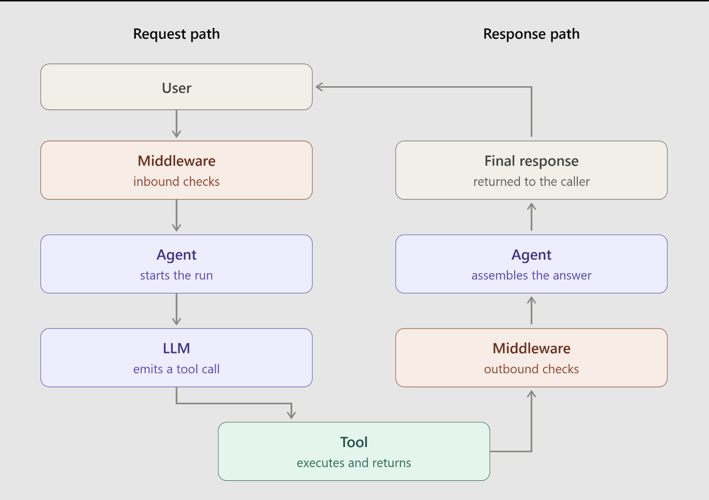

Middleware is for autheticate, validation, logging, token monitoring




```
User
  ↓
AI Agent
  ↓
Agent Middleware
  ├── Tools / APIs
  ├── Databases
  ├── Other agents
  ├── Authentication
  ├── Memory / state
  ├── Logging & monitoring
  └── Safety / permissions
```

## What does it actually do?
Suppose you build an AI agent that can answer customer questions and issue refunds.

```
Agent → Stripe API
Agent → Customer Database
Agent → Email
```

The agent has to know how to authenticate, call each API, handle errors, enforce permissions, log actions, etc.

With middleware:

```
Agent
  ↓
Middleware
  ↓
┌────────────┬─────────────┬───────────┐
│ Stripe     │ Customer DB │ Email     │
└────────────┴─────────────┴───────────┘
```

The middleware can provide standardized interfaces and handle the operational details.

| Responsibility                   | Example                                                   |
| -------------------------------- | --------------------------------------------------------- |
| **Tool routing**                 | Decide which API/tool an agent can call                   |
| **Authentication**               | Manage API keys, OAuth tokens, service identities         |
| **Authorization**                | Prevent an agent from refunding >$1,000                   |
| **State management**             | Maintain conversation/task state                          |
| **Observability**                | Log tool calls, latency, errors, costs                    |
| **Retries**                      | Retry a failed API request                                |
| **Guardrails**                   | Block unsafe or unauthorized actions                      |
| **Context management**           | Give the agent relevant data without overwhelming it      |
| **Protocol translation**         | Convert an agent's request into the format an API expects |
| **Agent-to-agent communication** | Let specialized agents communicate                        |

> Agent middleware is the infrastructure layer that manages how AI agents interact with tools, data, other agents, and external systems.

# Middleware Hooks
Yes. Middleware hooks are basically predefined points where you can insert your own logic into an agent's execution flow.

| Hook              | Runs                      | Main use                          |
| ----------------- | ------------------------- | --------------------------------- |
| `before_agent`    | Before the agent starts   | Initialize/validate               |
| `before_model`    | Before each model call    | Modify/check model state          |
| `after_model`     | After each model response | Inspect/modify response           |
| `after_agent`     | After the agent finishes  | Cleanup/final processing          |
| `wrap_model_call` | Around each model call    | Full control over model execution |
| `wrap_tool_call`  | Around each tool call     | Full control over tool execution  |

```
                 AGENT
                   │
           before_agent
                   │
                   ▼
        ┌──────────────────┐
        │    MODEL LOOP    │
        │                  │
        │  before_model    │
        │       ↓          │
        │  wrap_model_call │
        │       ↓          │
        │      MODEL       │
        │       ↓          │
        │  after_model     │
        │       ↓          │
        │    Tool needed?  │
        │       │          │
        │       ▼          │
        │ wrap_tool_call   │
        │       ↓          │
        │      TOOL        │
        │       │          │
        │       └──→ MODEL │
        └──────────────────┘
                   │
                   ▼
             after_agent
```
     

### There are basically two kinds you should remember:

1. Lifecycle hooks
   
```
@before_agent
@before_model
@after_model
@after_agent
```

These are like:
> "Tell me when this event happens."

They are good for logging, validation, state changes, metrics, etc.

2. Wrappers

```
@wrap_model_call
@wrap_tool_call
```
These are:
> "Give me control around this operation."

That's why they receive: request, handler

and you explicitly do: result = handler(request)


[Github Example](https://github.com/telusko-aliens/agentic-ai-engineering-with-python/tree/main/Agent%20Middleware%2006-09-2026/middleware)


