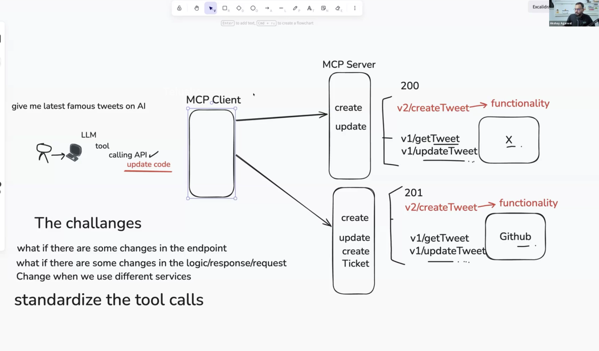
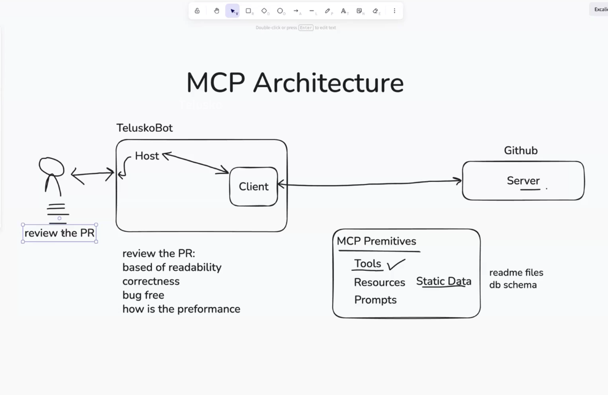

MCP standardize the Tool calls.






# MCP primitives
Tools
Resources (Static Data)
Prompts

these above three things shared by MCP server. 

Tools - 
  - tools/list
  - tools/call

Resources
  - resources/list
  - resources/subscribe
  - resounces/unsubscribe

Prompts
  - prompts/list
  - prompts/get

# MCP Protocol (more in detail)

MCP (Model Context Protocol) defines several primitives that allow an MCP client to discover and interact with an MCP server.

## Tools

- `tools/list` — Lists the tools available on the MCP server.
- `tools/call` — Calls/executes a specific tool with the provided arguments.

## Resources

- `resources/list` — Lists the resources available from the MCP server.
- `resources/subscribe` — Subscribes to updates for a specific resource.
- `resources/unsubscribe` — Cancels an existing resource subscription.

## Prompts

- `prompts/list` — Lists the prompt templates available on the MCP server.
- `prompts/get` — Retrieves a specific prompt template, optionally with arguments.

## Summary

| Primitive | Purpose |
|---|---|
| **Tools** | Perform actions or execute functions |
| **Resources** | Provide data/context to the client |
| **Prompts** | Provide reusable prompt templates |

> **Note:** These are MCP protocol operations used for communication between an MCP client and MCP server. They are not all "tools" in the general sense; `Tools`, `Resources`, and `Prompts` are separate MCP primitives.


# MCP architectural layer

MCP is built on JSON-RPC 2.0, so “MCP data layer” needs a more precise meaning.

```
┌──────────────────────────────┐
│          AI / Host           │
└──────────────┬───────────────┘
               │
          MCP Client
               │
        MCP protocol
        (JSON-RPC 2.0)
               │
┌──────────────▼───────────────┐
│          MCP Server          │
│                              │
│  Tools   Resources   Prompts │
└──────────────┬───────────────┘
               │
          Data / APIs
               │
     DB / Files / SaaS / etc.
```


# Why Anthropic decided to go with JSON RPC?

- Lightweighted
- Bidirectional
- Transportation - HTTP, stdio, sockets
- Batching
- Notification


