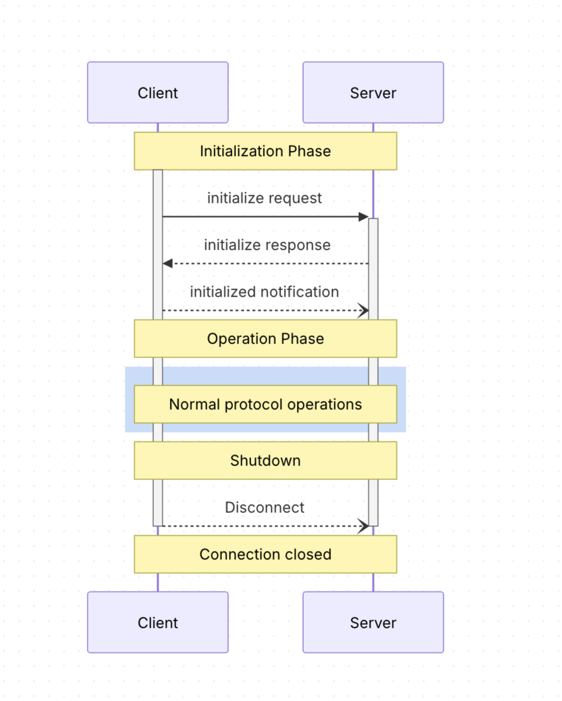

# MCP Lifecycle

**MCP Lifecycle – Easy Explanation with Examples**

The Model Context Protocol (MCP) has 3 clear stages for every connection between a **Client** (the AI app) and a **Server** (the tool/resource provider).

Think of it like starting a phone call with a friend.

---

### 1. Initialization (The Handshake)

This **must** be the first thing that happens.  
Nothing else is allowed until both sides finish this step.

#### Step-by-step with example:

**Client sends `initialize` request:**

```json
{
  "jsonrpc": "2.0",
  "id": 1,
  "method": "initialize",
  "params": {
    "protocolVersion": "2025-03-26",
    "capabilities": {
      "roots": { "listChanged": true },
      "sampling": {}
    },
    "clientInfo": {
      "name": "MyAIApp",
      "version": "1.0.0"
    }
  }
}
```

**What the client is saying:**
- “I speak version 2025-03-26”
- “I can handle file roots and sampling”
- “My name is MyAIApp”

---

**Server replies:**

```json
{
  "jsonrpc": "2.0",
  "id": 1,
  "result": {
    "protocolVersion": "2025-03-26",
    "capabilities": {
      "logging": {},
      "prompts": { "listChanged": true },
      "resources": { "subscribe": true, "listChanged": true },
      "tools": { "listChanged": true }
    },
    "serverInfo": {
      "name": "WeatherServer",
      "version": "2.1.0"
    },
    "instructions": "Use the get_weather tool for current weather."
  }
}
```

**What the server is saying:**
- “I also speak version 2025-03-26”
- “I offer tools, resources, prompts, and logging”
- “My name is WeatherServer”

---

**Client sends `initialized` notification** (no reply needed):

```json
{
  "jsonrpc": "2.0",
  "method": "notifications/initialized"
}
```

**Meaning:** “Handshake complete. I’m ready to work.”

---

### 2. Operation (Normal Work)

Now both sides can freely talk using only the features they agreed on.

**Example – Client asks for available tools:**

```json
{
  "jsonrpc": "2.0",
  "id": 2,
  "method": "tools/list"
}
```

**Server replies with tools:**

```json
{
  "jsonrpc": "2.0",
  "id": 2,
  "result": {
    "tools": [
      {
        "name": "get_weather",
        "description": "Get current weather",
        "inputSchema": { ... }
      }
    ]
  }
}
```

They keep exchanging messages like this until one side wants to stop.

---

### 3. Shutdown (Clean Goodbye)

There is **no special goodbye message**.  
They just close the connection.

#### Example 1 – Using stdio (local process)
1. Client closes the input stream to the server process.
2. Waits a few seconds.
3. If server doesn’t exit → sends `SIGTERM`.
4. If still alive → sends `SIGKILL`.

#### Example 2 – Using HTTP
Just close the HTTP connection. That’s it.

---

### Extra Rules Made Simple

**Timeouts**  
If you send a request and get no reply within a few seconds, cancel it and stop waiting.  
This prevents the connection from hanging forever.

**Error Example** (Version mismatch):

```json
{
  "jsonrpc": "2.0",
  "id": 1,
  "error": {
    "code": -32602,
    "message": "Unsupported protocol version",
    "data": {
      "supported": ["2024-11-05"],
      "requested": "2025-03-26"
    }
  }
}
```

---

### Quick Summary Table

| Phase            | What Happens                          | Example Message                  | Who Starts It |
|------------------|---------------------------------------|----------------------------------|---------------|
| Initialization   | Handshake + agree on version & features | `initialize` + `initialized`    | Client       |
| Operation        | Normal work (tools, resources, etc.)  | `tools/list`, `tools/call` etc. | Both         |
| Shutdown         | Cleanly close the connection          | Close stream / HTTP connection  | Usually Client |

That’s the full lifecycle — clean start → normal work → clean end.

