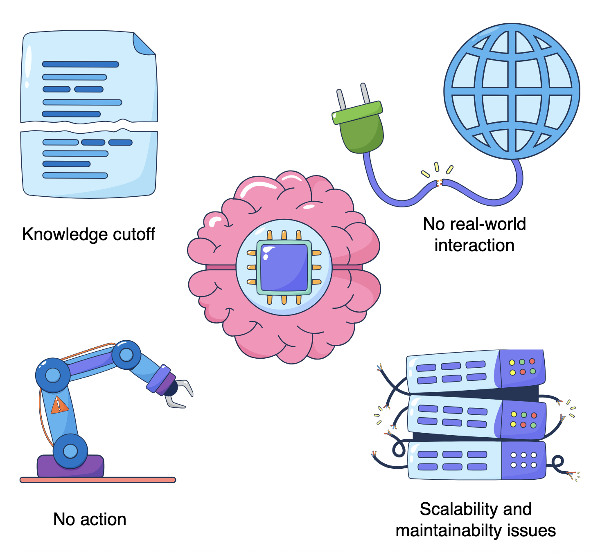

> Suppose If I give command to the AI: Reschedule all the meeting tommorow to friday if friday is clear, and send out updated invites.

A traditional, standalone LLM could perfectly explain the how to reschedule meetings.

Detailing like check calendar, find open slot, send emails. It cannot perform any of these operations.

To bridge this gap and enable AI systems to go beyond mere text generation to proactive problem-solving, we need a new paradigm that empowers them with context, tools, and agency.

# Limitations of standalone LLMs

1. fixed knowledge cutoffs.
2. Lack of real world interaction.
3. LLMs are designed to generate text, not to plan or execute multi-step tasks
4. Challenges in scalability and maintainability for complex applications![image.png]

# Introducing agentic AI: A paradigm shift

Given the inherent limitations of standalone large language models, a new paradigm is emerging: agentic AI.

This approach moves beyond simply generating text or completing isolated tasks.

## The four pillars of agentic systems#

1. **Perception**: It refers to the agent’s ability to understand its environment and gather relevant information. This step monitors live traffic, new delivery requests, package statuses, and vehicle locations.

2. **Reasoning**: Once an agent perceives information, it processes data to plan and make decisions. This step analyzes data to determine efficient routes and prioritize deliveries.

3. **Action**: This is the agent’s ability to execute reasoned decisions and interact with its environment, often via external tools. The agent updates driver routes, sends customer notifications, and logs deliveries in this step.

4. **Memory**: Agents need memory to store and recall past experiences, learned knowledge, and the ongoing state. This step stores historical data to refine operations and learn optimal patterns.

# Empowering agents: External tools and data

- While an agent’s core intelligence is internal
- This crucial connectivity enables agents to interact with the real world, perform dynamic tasks, and make informed decisions, transforming them into truly autonomous and practical AI systems.

1. Bridging the knowledge gap: Agents overcome LLM’s “staleness” by dynamically querying external sources (e.g., web search, APIs) for up-to-the-minute information. For example, an agent checks livestock prices.
   
2. Extending capabilities with APIs: Agents directly interact with external systems by formulating precise API calls, moving beyond advice to autonomously executing tasks like updating a project board. For example, an agent adds a new task to Jira.

   
3. Orchestrating complex workflows: Agents intelligently combine internal reasoning with external tool interactions, breaking down complex problems (like planning a trip) into sequential, actionable steps. For example, an agent books flights, hotels, and activities for a vacation.

