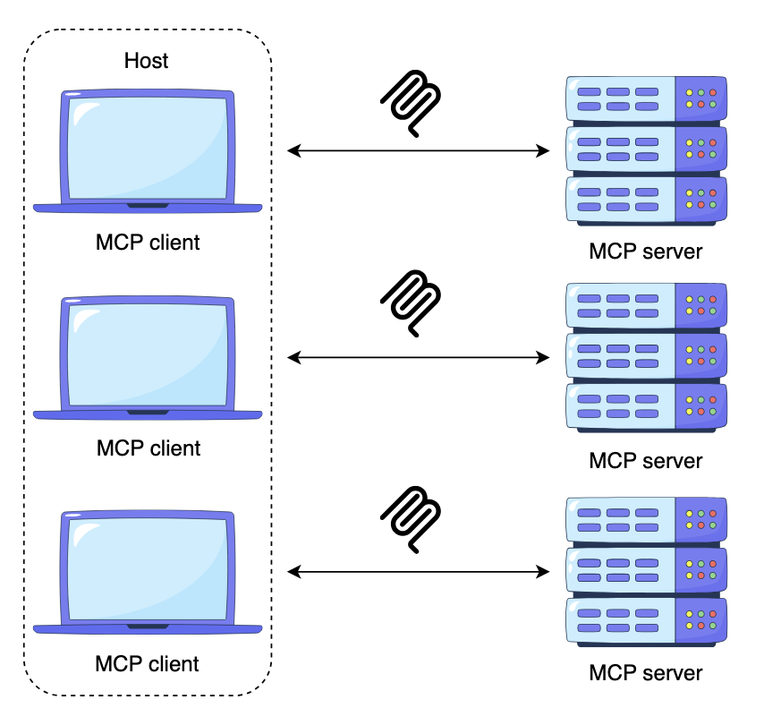

# What is Model Context Protocol (MCP)?
 (MCP) operates on a principle that has been the backbone of the internet for decades: the client-server architecture.

In the MCP ecosystem:

- The MCP host is the application where the AI model runs (e.g., a chatbot interface, AI agents, IDEs).
- The MCP client resides within the host and is responsible for making requests to external tools and data sources. It acts on behalf of the AI model and maintains 1:1 connections with the server while residing inside the host.
- The MCP server exposes an external tool or data source (like a database, API, or local file system). It serves information and capabilities to the client in a standardized format that the AI can understand.



The basic idea
Think of MCP as USB-C for AI applications.
Instead of every AI application building a custom integration for every service, MCP provides a common protocol:

```
                    ┌─────────────────┐
                    │   AI Assistant  │
                    │  (MCP Client)   │
                    └────────┬────────┘
                             │
                         MCP protocol
                             │
              ┌──────────────┴──────────────┐
              │                             │
      ┌───────▼────────┐          ┌─────────▼───────┐
      │  GitHub MCP    │          │  Database MCP   │
      │    Server      │          │     Server      │
      └───────┬────────┘          └─────────┬───────┘
              │                             │
          GitHub API                    PostgreSQL
```

The AI doesn't need to know the internal details of GitHub's API or PostgreSQL. It talks MCP to an MCP server, and that server handles the underlying system.

The important pieces

1. MCP Host

The application containing the AI model.

Examples include an AI coding environment or desktop AI application.

2. MCP Client

The component inside the host that maintains the connection to an MCP server.

3. MCP Server

A program that exposes capabilities to the AI.

An MCP server might expose:

- Tools — actions the model can invoke
 - create_issue
 - search_database
 - send_email
- Resources — information the model can read
 - files
 - documents
 - database records
- Prompts — reusable interaction templates/workflows

So conceptually:

```
MCP Server
│
├── Tools
│   ├── search_github()
│   └── create_issue()
│
├── Resources
│   ├── repository files
│   └── documentation
│
└── Prompts
    └── code_review()
```
