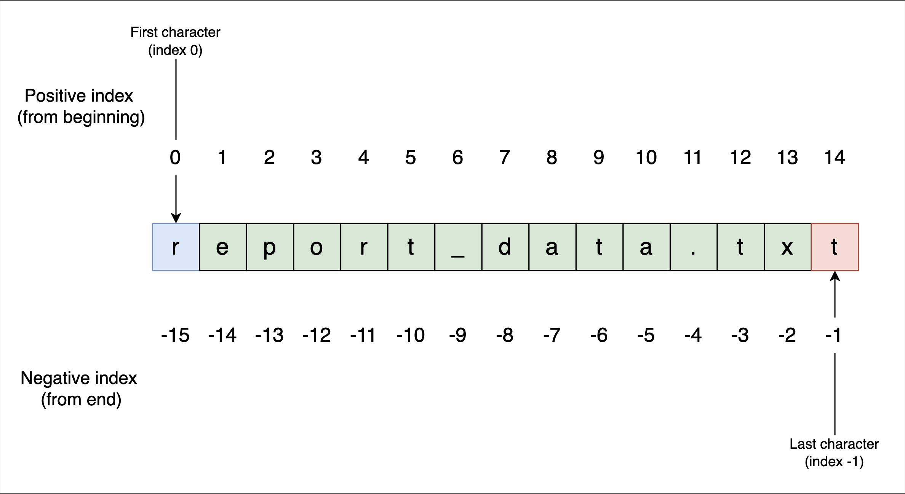

Python string basics including creation, indexing, slicing, and immutability .

# Creating string literals

```py
# Using single and double quotes
greeting = "Hello, Developer"
alert = 'System status: "Critical"'
contraction = "It's a great day to code"

print(greeting)
print(alert)
print(contraction)
```

# Concatenation: Joining strings

```py
first_name = "Ada"
last_name = "Lovelace"

# Concatenating strings
full_name = first_name + " " + last_name

print(full_name)
```

# Indexing and length

- Python uses zero-based indexing, meaning the first character is at index 0, not 1
- We access characters using square brackets []
- Uniquely, Python also supports negative indexing, which allows us to access characters starting from the end

```py
filename = "report_data.txt"

# Accessing by positive index
first_char = filename[0]

# Accessing by negative index
last_char = filename[-1]

print("First:", first_char)
print("Last:", last_char)
print("Length:", len(filename))
```


Visual guide to positive and negative string indexing in Python

# Slicing: Extracting substrings

- When we need a range of characters rather than just one, we use slicing. The syntax is [start:stop].
- Python extracts characters starting at the start index up to, but not including, the stop index.
- If we omit the start, it defaults to the beginning (0)
- If we omit the stop, it defaults to the end of the string.

```py
email = "user@example.com"

# Extracting 'user' (indices 0, 1, 2, 3)
username = email[0:4]

# Extracting 'example.com' (index 5 to the end)
domain = email[5:]

# Re-assigning or combining to create the final variable
complete_email = username + "@" + domain

print(f"Username: {username}")
print(f"Domain: {domain}")
print(f"Full Address: {complete_email}")
```

> Note that [:] will default to the original string.

# Immutability of strings

- strings are immutable. This means that once a string is created, its contents cannot be changed. We cannot simply overwrite a character at a specific index.

```py
text = "Hyllo"

# This causes an error!
text[1] = "e"

# TypeError: 'str' object does not support item assignment
```

- To "modify" a string, we must create a new string containing the desired changes and assign it back to the variable

```py
text = "Hyllo"

# Correct way: Create a new string by slicing and concatenation
fixed_text = text[0] + "e" + text[2:]

print(fixed_text)
```

# Built-in string methods

- When working with text, Python string methods are built-in functions that perform common transformations. Since strings are immutable, these methods always return a new string; they do not change the original variable.

> We access these methods using the dot operator (.). While we will explore the mechanics of objects and dots later, for now, you can think of it as "asking" the string to perform an action on itself.

| Method                | Description                                                                                       |
| --------------------- | ------------------------------------------------------------------------------------------------- |
| `strip()`             | Removes whitespace (spaces, tabs, newlines) from the beginning and end of the string.             |
| `upper()` / `lower()` | Converts text to all upper or lower case.                                                         |
| `replace(old, new)`   | Swaps occurrences of a substring with another.                                                    |
| `split(delimiter)`    | Breaks a string into a list of substrings based on a separator character (like a comma or space). |

```py
raw_data = "  Python,Java,C++  "

# Strip removes surrounding whitespace
clean_data = raw_data.strip()
print(clean_data)

# Upper converts to uppercase
upper_data = clean_data.upper()
print(upper_data)

# Replace swaps text
modified_data = upper_data.replace("JAVA", "RUST")
print(modified_data)

# Split breaks the string into a list
languages = modified_data.split(",")
print(languages)
```

# String formatting with f-strings

```py
item = "Laptop"
quantity = 2

# Using an f-string to embed values
summary = f"Order details: {quantity} x {item}"

print(summary)
```


