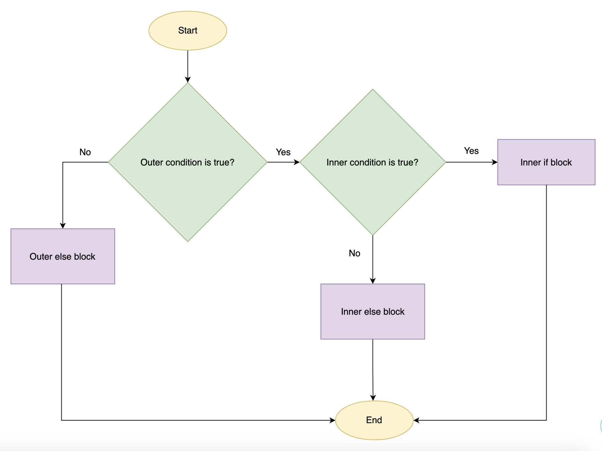

# if

```py
temperature = 35

print("Checking safety...")

if temperature > 30:
    print("Warning: High temperature detected!") # To be executed, if True
    print("Engaging cooling system.")            # To be executed, if True

print("System check complete.")
````

- an if statement ends with a colon (:)

# The fallback: else

```py
password = "secret_code"
input_attempt = "password123"

if input_attempt == password:
    print("Access Granted.")
else:
    print("Access Denied.")
```

# Multiple options: elif

```py
traffic_light = "Yellow"

if traffic_light == "Red":
    print("Stop immediately.")
elif traffic_light == "Yellow":
    print("Slow down and prepare to stop.")
elif traffic_light == "Green":
    print("Proceed with caution.")
else:
    print("Error: Unknown signal status.")
```

# Nested conditionals

```py
has_ticket = True
is_vip = False

if has_ticket:
    print("Welcome to the event.")
    if is_vip:
        print("Please proceed to the VIP lounge.")
    else:
        print("Your seat is in the general admission area.")
else:
    print("You must purchase a ticket to enter.")
```



# Practical application: Interactive decision maker

```py
# Shipping Calculator
weight_input = input("Enter package weight (kg): ")
weight = float(weight_input)  # Convert string input to float

if weight <= 0:
    print("Error: Weight must be positive.")
elif weight <= 2:
    cost = 5.00
    print(f"Standard shipping: ${cost}")
elif weight <= 10:
    cost = 10.00
    print(f"Medium shipping: ${cost}")
else:
    cost = 20.00
    print(f"Heavy shipping: ${cost}")
```


