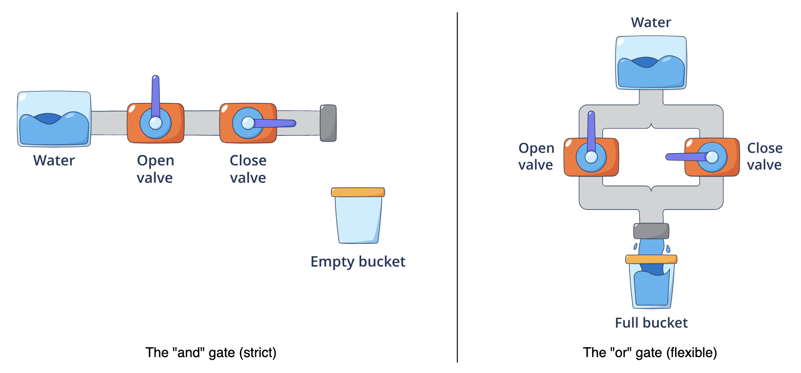

# Combining checks with and and or

```py
# User status variables
is_admin = True
is_logged_in = True
has_guest_pass = False

# Strict check: Both must be true
if is_logged_in and is_admin:
    print("Welcome, Administrator. You have full access.")

# Flexible check: Only one needs to be true
if is_admin or has_guest_pass:
    print("Access granted to the restricted area.")

# Fails because strict and requires both
is_admin = False
if is_logged_in and is_admin:
    print("This line will not print.")
else:
    print("Access denied: You must be logged in as an admin.")
```

example




# Negating conditions with not

```py
status = "pending"
is_banned = False

# Check if the user is NOT banned
if not is_banned:
    print("User is in good standing.")

# Combine negation with comparison
if status != "complete":
    print("Please finish the current task.")
```

# Short-circuit evaluation
Python employs a strategy called short-circuit evaluation to optimise performance and prevent errors. When evaluating a compound condition, Python stops as soon as the final result is known.

In an and expression: If the first condition is False, the entire expression must be False. Python skips the second condition entirely.

In an or expression: If the first condition is True, the entire expression must be True. Python skips the second condition entirely.

```py
count = 0
total = 100

# Safety check using short-circuiting
# Python sees 'count != 0' is False
# It stops immediately and DOES NOT compute 'total / count'
if count != 0 and (total / count) > 5:
    print("Average is greater than 5")
else:
    print("Skipped division to prevent a crash")

count = 10
# Now the first part is True, so Python proceeds to check the second part
if count != 0 and (total / count) > 5:
    print(f"Calculation successful. Average is {total / count}")
```

# Grouping and precedence
When we mix and, or, and not in a single statement, Python follows a strict order of operations (precedence):
1. not (highest priority)
2. and
3. or (lowest priority)

- This default order can lead to logic bugs if we aren't careful.
- We use parentheses () to group conditions explicitly, forcing Python to evaluate our logic in the order we intend

```py
age = 20
has_ticket = False
is_vip = True

# Ambiguous logic (relying on default precedence)
# Reads as: (age > 18 and has_ticket) OR is_vip
# Result: True (because is_vip is True, the whole OR succeeds)
if age > 18 and has_ticket or is_vip:
    print("Default precedence allowed entry")

# Explicit logic (grouping with parentheses)
# Reads as: age > 18 AND (has_ticket or is_vip)
# Result: True (Age is fine, and they have VIP status)
if age > 18 and (has_ticket or is_vip):
    print("Explicit grouping allowed entry")

# Changing the scenario to fail
age = 15
# Even though they have VIP, the age check is mandatory due to grouping
if age > 18 and (has_ticket or is_vip):
    print("This will not print")
else:
    print("Entry denied: Age requirement not met")
```


