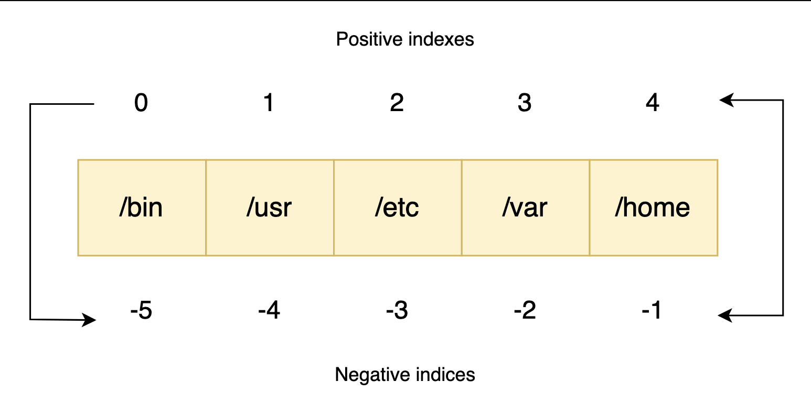

# Creating lists

- A list is an ordered sequence of elements enclosed in square brackets [], with items separated by commas.

Dynamic sizing: They can grow or shrink as we add or remove items.

Heterogeneity: Unlike strict arrays in other languages that require a single data type, a Python list can hold different types of data at the same time. We can store integers, strings, booleans, and even other lists inside a single container.

```py
# Defining lists with different types of data
server_ids = [101, 102, 103, 104]
mixed_config = ["production", 8080, True, 3.11]
empty_list = []

print(f"Servers: {server_ids}")
print(f"Configuration: {mixed_config}")
print(f"Empty: {empty_list}")
print(f"Empty List Type: {type(empty_list)}")
```

# Accessing elements by index

-  Python uses zero-based indexing (means start from 0 and then so on...)

```py
# Accessing elements using positive indexes
colors = ["red", "green", "blue", "yellow"]

primary = colors[0]
secondary = colors[2]

print(f"First color: {primary}")
print(f"Third color: {secondary}")
```
# Negative indexing

- As discussed earlier, Python supports negative indexing, where an index of -1 refers to the last element, -2 refers to the second-to-last element, and so on.

```py
# Accessing elements from the end of the list
file_paths = ["/bin", "/usr", "/etc", "/var", "/home"]

last_path = file_paths[-1]
second_last = file_paths[-2]

print(f"Last path: {last_path}")
print(f"Second to last: {second_last}")
```


# Slicing lists

Sometimes we need a subset of a list rather than a single item. By mastering how to slice a list in Python using the [start:stop:step] syntax, you can extract exactly the data you need.

- start: The index where the slice begins (inclusive).

- stop: The index where the slice ends (exclusive).

- step: The interval between indexes (optional, defaults to 1).

If we omit start, Python defaults to 0. If we omit stop, Python defaults to the end of the list.

```py
# Extracting sub-lists using slicing
metrics = [10, 20, 30, 40, 50, 60, 70, 80]

first_three = metrics[0:3]
middle_segment = metrics[3:6]
every_second = metrics[::2]
reverse_metrics = metrics[::-1]

print(f"First three: {first_three}")
print(f"Middle segment: {middle_segment}")
print(f"Every second: {every_second}")
print(f"Reversed: {reverse_metrics}")
```
# Modifying lists (mutability)

- Unlike strings, which are immutable (unchangeable), lists are mutable.
-  we can check its unique identity using the id() function

```py
# Modifying list elements in place
user_roles = ["admin", "editor", "viewer", "guest"]
# Printing the original ID first
print(f"Original ID: {id(user_roles)}")
# Printing the original roles first
print(f"Original roles: {user_roles}")

# Update a slice (replace multiple elements)
user_roles[0:2] = ["superuser", "moderator"]

# Printing the ID after replacing the elements
print(f"Same ID:     {id(user_roles)}")
# Printing the roles after replacing the elements
print(f"Updated roles: {user_roles}")
```


