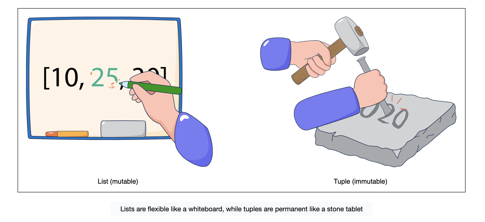
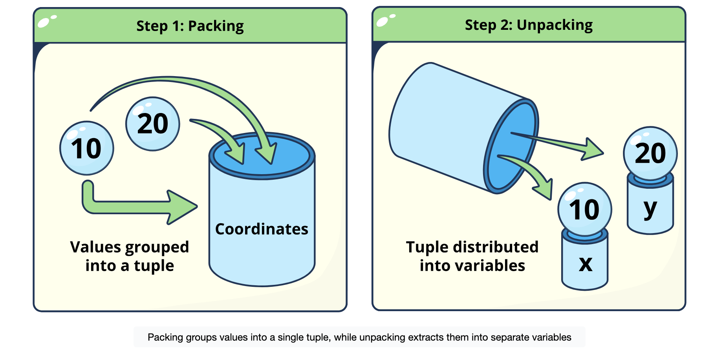

- Tuples in Python are created by placing a sequence of values inside () and separating each item with a comma.
- While lists are commonly used to store collections of similar items, tuples are often used to group heterogeneous data, meaning values of different types that logically belong together
- tuples are typically used when each position has a specific meaning
- the values together form a single logical unit.

```py
# Create a tuple representing an RGB color (Red, Green, Blue)
red_color = (255, 0, 0)

# We can mix types, like a simple user record
user_record = (101, "Alice", True)

print(f"Red: {red_color}")
print(f"User: {user_record}")
```

# Immutability in action
- The defining feature of a tuple is immutability.
- In a list, we can write `my_list[0] = 5` to update the first item. In a tuple, this action is not allowed.

```py
dimensions = (800, 600)

# We can read values using indexing, just like a list
width = dimensions[0]
height = dimensions[1]

print(f"Width: {width}, Height: {height}")

# The following line would cause a TypeError if uncommented:
# dimensions[0] = 1024
```




# The single-element syntax trap
- There is a common syntactical pitfall when creating a tuple with only one item.
- Python uses parentheses for many things, including grouping mathematical operations like (5 + 2) * 3.
- To distinguish a tuple from a mere number in parentheses, Python requires a trailing comma for single-element tuples.
  
```py
# A number in parentheses is just a number
number_in_parens = (50)

# A number with a trailing comma is a tuple
tuple_with_comma = (50,)

print(f"Value: {number_in_parens}, Type: {type(number_in_parens)}")
print(f"Value: {tuple_with_comma}, Type: {type(tuple_with_comma)}")
```

# Packing and unpacking
One of Python's most elegant features is the ability to group values together and pull them apart seamlessly. We call them tuple packing and unpacking, respectively.

- Tuple packing: When we separate values with commas without using brackets, Python automatically "packs" them into a tuple. It groups distinct items into a single container.

- Tuple unpacking: Conversely, we can take a tuple and assign its elements to multiple variables in a single step. This allows us to extract data without accessing each index manually (e.g., data[0], data[1]).

```py
# Tuple Packing: Python groups these integers into one tuple object
coordinates = 10, 20
print(f"Coordinates: {coordinates} (Type: {type(coordinates)})")

# Tuple Unpacking: Python distributes the tuple items into variables x and y
x, y = coordinates
print(f"x is {x}, y is {y}")

# Practical usage: Swapping variables
a = 5
b = 10
a, b = b, a  # Packs (10, 5) then unpacks immediately
print(f"a: {a}, b: {b}")
```



# Tuples as records
A record is a collection of related data where the position of the item gives it meaning. Because tuples are fixed in size and order, they are excellent for representing records.

```py
# A tuple acting as a 'Student Record'
# Index 0 = Name (string)
# Index 1 = Age (int)
# Index 2 = GPA (float)
student_record = ("John Doe", 20, 3.8)

# Unpacking gives the data semantic meaning (labels)
name, age, gpa = student_record

print(f"Student: {name}")
print(f"Age: {age}")
print(f"GPA: {gpa}")
```

- Tuples provide a layer of safety and structure that lists cannot.
- By using tuples for data that should not change, like configuration settings, database records, or coordinate pairs, we write code that is easier to reason about.


