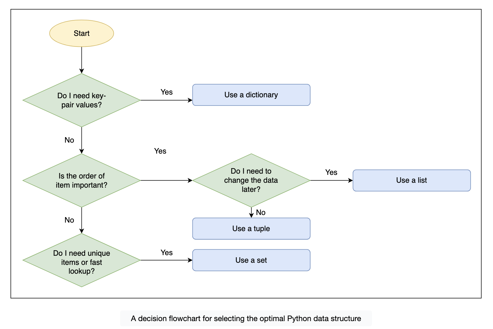

# The four pillars of data

To make an informed choice, we must look at three specific attributes of a collection:

- Mutability: Can we change it after creation?
- Order: Is the position of items preserved?
- Uniqueness: Does it automatically remove duplicates?

| Collection     | Syntax  | Mutable? | Ordered?           | Unique Items? | Primary Use Case                                       |
| -------------- | ------- | -------- | ------------------ | ------------- | ------------------------------------------------------ |
| **List**       | `[]`    | Yes      | Yes                | No            | Sequences we need to modify or iterate over            |
| **Tuple**      | `()`    | No       | Yes                | No            | Fixed records (like coordinates) that shouldn't change |
| **Dictionary** | `{k:v}` | Yes      | Yes (by insertion) | Keys only     | Fast lookup of data using a label (key-value)          |
| **Set**        | `{}`    | Yes      | No                 | Yes           | Fast membership testing and removing duplicates        |

> Note: As of Python 3.7+, dictionaries are strictly ordered by insertion. However, unlike lists, we typically choose dictionaries for retrieval by key, not for their ability to keep things in order.

# Performance: The cost of looking up data

> Performance rule:
If you need to check if item in collection frequently, always use a set or a dictionary.
If order matters more than lookup speed (e.g., a history log), use a list.

# Mutability as a safety feature#
Beginners often ask: "If a list can do everything a tuple does, why use a tuple?"
- The answer is safety through immutability. If we pass a list to a function, that function could accidentally remove an item or sort the list, which would break our code elsewhere. If we pass a tuple, we guarantee that the data remains exactly as we defined it.
- Using a tuple signals to other developers (and our future selves): "This data is a fixed record. Do not change it."

# A decision framework

## Applied scenarios
Let's look at a practical example of a single program that uses all four structures for the roles they play best. Imagine we are building a simple access control system for an event. We need to store:

1. Valid user IDs (fast lookup, unique).
2. User details (key-value mapping).
3. Log of entry times (ordered sequence, strictly append-only).
4. Venue coordinates (fixed pair, never changes).

